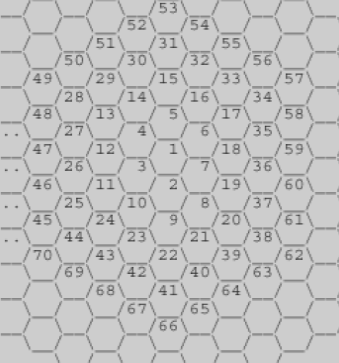
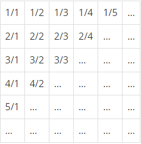

# 8. 수학

> 손익분기점

```python
# 고정 비용 A, 가변 비용 B, 판매 비용 C
# 총 수입이 총 비용보다 많아지는 지점을 구해라
A,B,C = map(int, input().split())
if B >= C:
    print(-1)
    # 가변 비용이 판매 비용보다 클 경우 손익분기점이 발생하지 않는다.
else:
    ans = (A // (C-B))+1
    # 판매 비용과 가변 비용의 차액을 고정 비용으로 나눈 몫보다 1큰 지점이 손익분기점
    print(ans)
```

> 벌집



```python
# 위의 그림과 같은 벌집에서 입력받은 지점까지의 거리(시작과 끝 포함) 
# 2~7, 8~19, 20~37과 같이 지점까지의 거리가 같은 집합이 존재
# 입력 받은 지점이 어떤 집합에 속해있는지를 판단해 거리를 구한다.
N = int(input())
limit = 1
n = 0

while True:
  if N == 1:
    print(1)
    break
  else:
    n += 1
    limit += 6*n
    if limit >= N:
        print(n+1)
        break
```

> 분수찾기



```python
# 1/1 → 1/2 → 2/1 → 3/1 → 2/2 → … 과 같은 지그재그 순서로 차례대로 1번, 2번, 3번, 4번, 5번, … 분수
# [1/1], [1/2, 2/1], [3/1, 2/2, 1/3]과 같이 집합이 존재
# n을 증가 시키면서 어떤 그룹에 존재하는지 확인
# n이 짝수,홀수에 따라서 분수의 순서가 바뀌기 때문에 고려해서 분모와 분자를 설정한다.
N = int(input())
li = 1
n = 1

while True:
  if N == 1:
    up, down = 1,1
    break
  else:
    n = n+1
    li += n
    if li >= N:
        st = li - N
        if n %2 != 0:
            up, down = st + 1, n - st
            break
        else:
            up, down = n - st, st + 1
            break
print(up, '/', down, sep='')  
```

> 달팽이는 올라가고 싶다

```python
A,B,V = map(int, input().split())
step = (V-B) / (A-B)
step = int(step) if step - int(step) == 0 else int(step) +1
print(step)
```

> ACM 호텔

```python
N = int(input())
for _ in range(N):
    H,W,People = map(int, input().split())
    room, floor = (People // H)+1, People % H
    if People % H == 0:
        room, floor = People // H, H
    ans = floor*100+room
    print(ans)
```

>부녀회장이 될테야

```python
N = int(input())
for _ in range(N):
    k = int(input())
    n = int(input())
    f_floor = [x for x in range(1,n+1)]
    for i in range(k):
        for j in range(1,n):
            f_floor[j] += f_floor[j-1]
    print(f_floor[-1])
```

