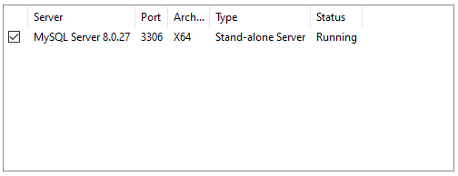
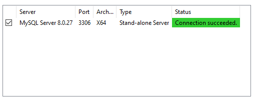
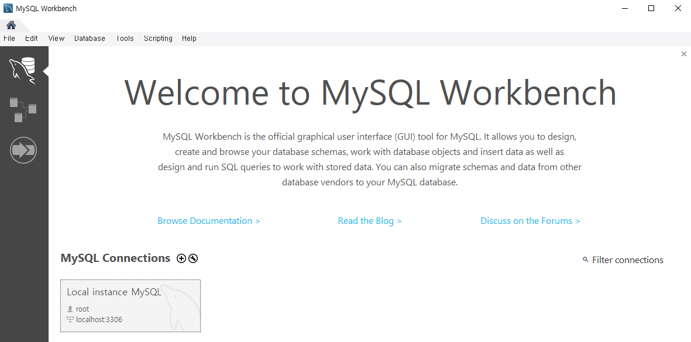

# 설치

 1. https://dev.mysql.com/downloads/windows/installer/8.0.html 접속
    - **mysql-installer-community-8.0.27.0.msi** 다운 및 설치

2. **MySQL Installer** 창에서 **Custom** 선택

3. **[MySQL Servers ]- [MySQL Server] - [MySQL Server 8.0] - [MySQL server 8.0.27 - X64 ]선택**

   **[Applications] - [MySQL Workbench] - [MySQLWorkbench 8.0] - [MySQL Workbench 8.0.27 - X64]**

   **[Documentation] - [Samples and Examples] - [Samples and Examples 8.0] - [Samples and Examples 8.0.27 - X64]** 추가

4. **Installation**에서 **Execute** 클릭 후 설치 완료 대기, 완료 후 Next 클릭

5. Next 버튼 진행 후 **[Accounts and Roles]**에서 MySQL 관리자의 비밀번호 저장 ~~0***~~

6. **[Windows Service Name]** 이름 MySQL로 변경, 필수요소는 아님

7. [**Apply Configuration**]에 설정된 내용 적용 **Execute** 클릭

8. [**Connect To Server**]에 연결할 서버에 root, 비밀번호 입력 후 연결 확인

9. **[Apply Configuration]**에서 Execute 클릭해 설정된 내용 적용

10. 설치 확인

