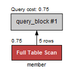
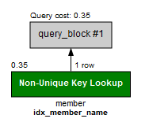
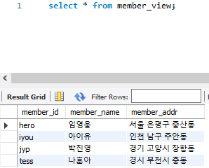
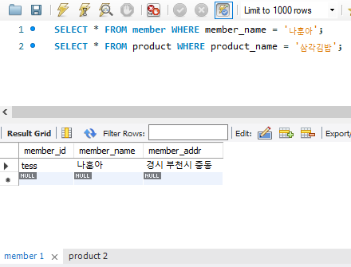
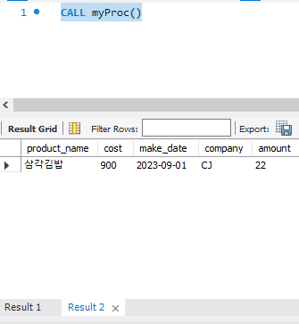

# 데이터 베이스 개체

## 1. 인덱스

> 밑의 SQL 문으로 member 테이블에서 '아이유'를 찾을 때는 1행부터 끝까지 전체를 살펴봐야 한다.
>
> ```sql
> SELECT * FROM member WHERE member_name = '아이유';
> ```
>
> **[Execution Plan]** 탭을 클릭해 **Full Table Scan**이라고 나온다. 전체 테이블 검색으로 처음부터 끝까지 검색해 오랜 시간이 걸린다.



1. 인덱스 생성
   - ON member(member_name)의 의미는 member 테이블의 member_name 열에 인덱스를 지정하라는 의미.
   - 위의 SQL 코드로 다시 검색하면 Non-Unique Key Lookup 이라고 나온다.

```SQL
CREATE INDEX idx_member_name ON member(member_name);
```




## 2. 뷰

> '가상의 테이블'

1. 기본적인 뷰 생성
   - 회원 테이블이 아닌 회원 뷰에 접근해도 테이블에 접근하는 것과 동일한 결과를 보여준다.

```sql
create view member_view
AS
	select * from member;
```

```sql
SELECT * FROM member_view;
```



## 3. 스토어드 프로시저

> SQL 안에서도 일반 프로그래밍 언어처럼 코딩을 할 수 있다.

1. 두 sql을 입력하고 한꺼번에 입력한다.
   - 매번 두 줄의 코딩을 입력시 불편



2. 하나의 스토어드 프로시저를 만들어 sql 문을 불러온다.

   - 구분 문자라는 의미의 **DELIMITER // ~ DELIMITER ;** 입력
   - **BEGIN, END** 사이에 SQL 문을 넣는다.
   - **CALL myProc()**를 이용해 두 줄을 입력하지 않아도 불러올 수 있다.

   ```SQL
   DELIMITER //
   CREATE PROCEDURE myProc()
   BEGIN
   	SELECT * FROM member WHERE member_name = '나훈아';
       SELECT * FROM product WHERE product_name = '삼각김밥';
   END //
   DELIMITER ;
   ```

   ```SQL
   CALL myProc()
   ```

   

