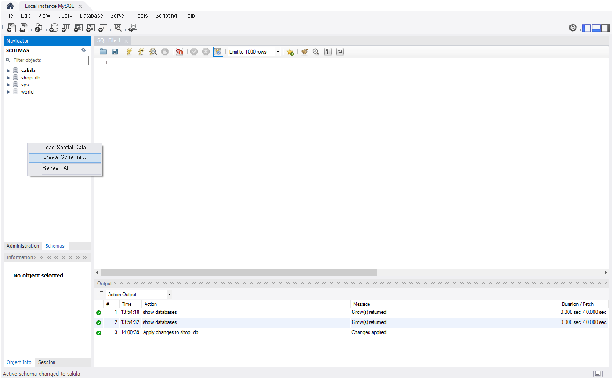
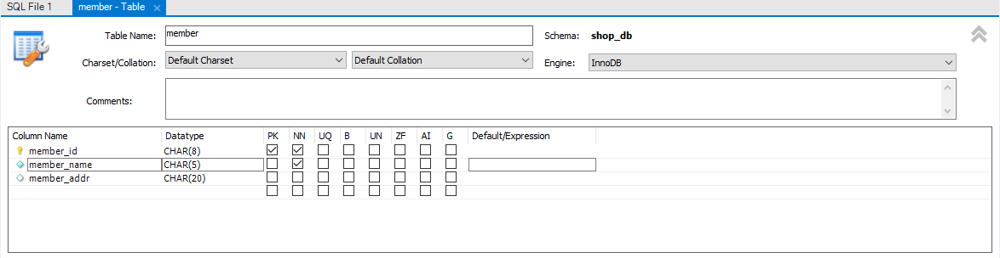
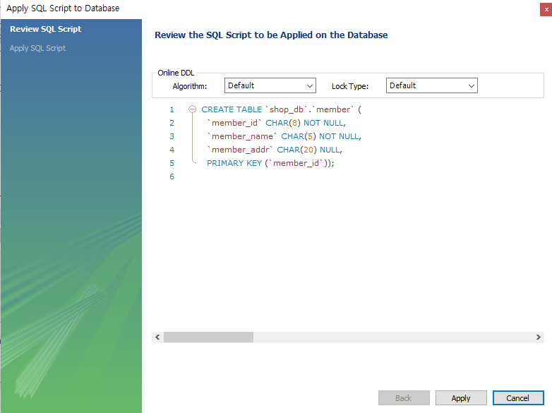
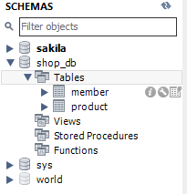
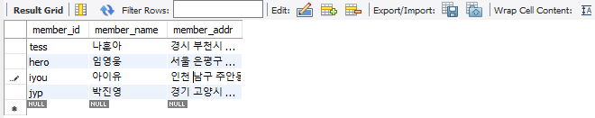
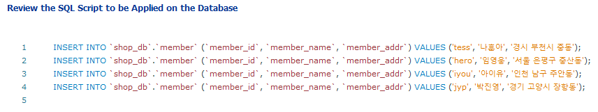
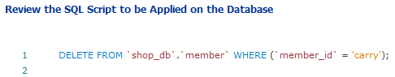
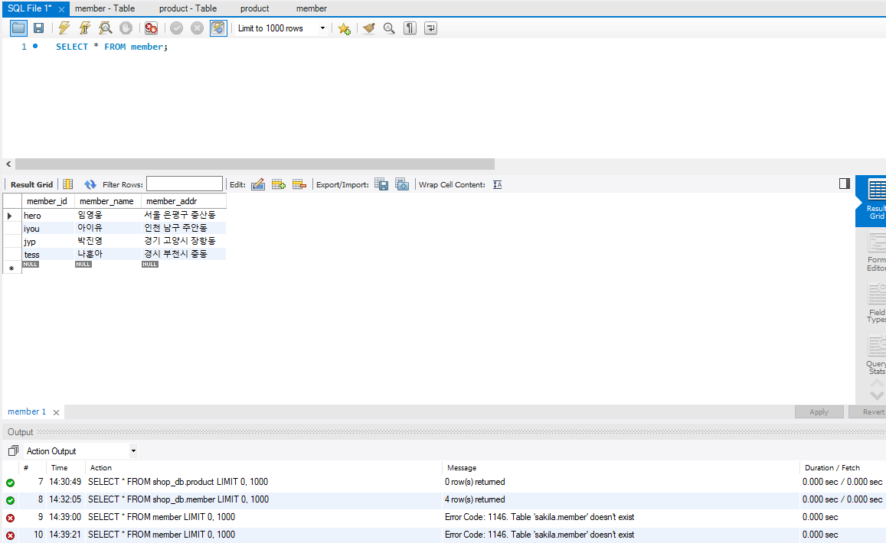
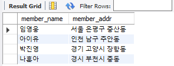
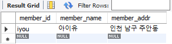

1. 데이터 베이스 만들기

1. **MySQL Workbench** 아이콘 클릭 후 좌측 하단의 **[Administration], [Schemas]** 탭에서 [Schemas] 탭을 누른 후 우클릭 후 Create Schema을 누른다. 이름을 설정하고 Apply를 클릭 해 *shop_db*라는 이름의 데이터 베이스를 생성한다.




# 2. 테이블 만들기

### 1) 테이블 설계하기

1. 회원 테이블

|     열 이름     |  영문 이름  | 데이터 형식 | 최대 길이 | 널 허용 안 함(Not Null) |
| :-------------: | :---------: | :---------: | :-------: | :---------------------: |
| 아이디(기본 키) |  member_id  | 문자(CHAR)  |   8글자   |           YES           |
|    회원 이름    | member_name | 문자(CHAR)  |   5글자   |           YES           |
|      주소       | member_addr | 문자(CHAR)  |  20글자   |           NO            |

2. 제품 테이블

|      열 이름       |  영문 이름   | 데이터 형식 | 최대 길이 | 널 허용 안 함(Not Null) |
| :----------------: | :----------: | :---------: | :-------: | :---------------------: |
| 제품 이름(기본 키) | product_name | 문자(CHAR)  |   4글자   |           YES           |
|        가격        |     cost     |  숫자(INT)  |           |           YES           |
|      제조일자      |  make_date   | 날짜(DATE)  |           |           NO            |
|      제조회사      |   comapny    | 문자(CHAR)  |   5글자   |           NO            |
|     남은 수량      |    amount    |  숫자(INT)  |           |           YES           |

## 2) 테이블 생성

1. MySQL Workbench 창의 [SCHEMAS] 패널의 *shop_db*의 확장하고 [Tables]를 우클릭 후 [Create Table]을 선택


2. [Table Name]에 이름을 입력하고 1)에서 설계했던 내용을 입력한다.
   - member_id가 기본 키로 설정해야 하므로 [PK]를 체크하고 널을 허용 안 하기 때문에 [NN]도 체크
   - 각 Datatype의 글자 수 제한은 (글자 수) 를 이용해 설정한다. 



3. **[Apply]** 버튼을 클릭하면 SQL 문이 보인다. 마찬가지로 **[Apply]**를 클릭해 적용한다.



4. 마찬가지로 제품(Product) 테이블도 생성해준다.



## 3. 데이터 입력

1. **[shop_db] - [Tables] - [member]** 를 선택 후 우클릭, **[Select Rows - Limits 1000]** 선택, **Result Grid** 창을 통해 데이터 확인

2. **[member_id], [member_name], [member_addr]** 항목을 임의로 입력 후 적용
   - **PK**에 의해 선정한 열 기준 오름차순으로 **자동 정렬**





3. 마찬가지로 **[product]** 테이블 입력. 수정시 수정할 데이터 클릭 후 변경.

   행의 제일 앞 부분을 클릭해 **[Delete Row]** 선택해 데이터 삭제



## 4. 데이터 활용

1. *shop_db* 선택 후 조회
   - SCHEMAS를 잘 못 선택하면 사진의 아래처럼 Table 'sakila.member' doesn't exist 라는 오류 발생
   - **[Output]** 패널에 현재 결과의 건수와 조회하는데 소요된 시간 표시
   - SQL에서 '*'는 모든 열을 의미한다.
   - ';' 을 제일 뒤에 붙여야 한다.

```SQL
SELECT * FROM member;
```



2. 회원 테이블 중 이름, 주소만 출력

```SQL
SELECT member_name, member_addr FROM member;
```



3. 특정 회원에 대한 정보만 추출

```SQL
SELECT * FROM member WHERE member_name = '아이유';
```



