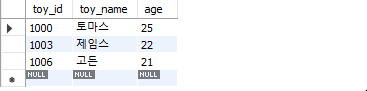

# 3. 기본문법


## ※ 데이터 베이스 만들기

- **DROP DATABASE** 를 이용해 기존의 merket_db를 삭제. 다시 실행할 경우 고려
- **CREATE DATABASE**를 이용해 market_db 생성

```sql
DROP DATABASE IF EXISTS market_db; 
CREATE DATABASE market_db;
```

- 회원 테이블 생성

```sql
USE market_db;
CREATE TABLE member -- 회원 테이블
( mem_id  		CHAR(8) NOT NULL PRIMARY KEY, -- 사용자 아이디(PK)
  mem_name    	VARCHAR(10) NOT NULL, -- 이름
  mem_number    INT NOT NULL,  -- 인원수
  addr	  		CHAR(2) NOT NULL, -- 지역(경기,서울,경남 식으로 2글자만입력)
  phone1		CHAR(3), -- 연락처의 국번(02, 031, 055 등)
  phone2		CHAR(8), -- 연락처의 나머지 전화번호(하이픈제외)
  height    	SMALLINT,  -- 평균 키
  debut_date	DATE  -- 데뷔 일자
);
```

- 구매 테이블 생성

```sql
CREATE TABLE buy -- 구매 테이블
(  num 		INT AUTO_INCREMENT NOT NULL PRIMARY KEY, -- 순번(PK)
   mem_id  	CHAR(8) NOT NULL, -- 아이디(FK)
   prod_name 	CHAR(6) NOT NULL, --  제품이름
   group_name 	CHAR(4)  , -- 분류
   price     	INT  NOT NULL, -- 가격
   amount    	SMALLINT  NOT NULL, -- 수량
   FOREIGN KEY (mem_id) REFERENCES member(mem_id)
);
```

- 데이터 입력

```sql
INSERT INTO member VALUES('TWC', '트와이스', 9, '서울', '02', '11111111', 167, '2015.10.19');
INSERT INTO buy VALUES(NULL, 'BLK', '지갑', NULL, 30, 2);
```

- 데이터 조회

```sql
SELECT * FROM member;
SELECT * FROM buy;
```


## 1. 기본 조회하기 SELECT ~ FROM

### 1) USE 문

- SELECT 문을 실행하기 앞서 먼저 데이터베이스를 지정해야 한다. DB를 지정 또는 변경을 위해 `USE 데이터베이스_이름;`을 쿼리 창에 입력
- 잘못된 데이터베이스를 입력할 경우 `error` 발생

```SQL
USE market_db;
```

### 2) SELECT 문

#### ① 기본 형식

```SQL
SELECT 열_이름
	FROM 테이블_이름
	WHERE 조건식
	GROUP BY 열_이름
	HAVING 조건식
	ORDER BY 열_이름
	LIMIT 숫자
```

- SELECT와 FROM
  - `*`는 모든 열을 의미, `FROM` 다음 테이블을 가져온다.

```SQL
USE market_db;
SELECT * FROM member;
```

- 같은 DB이기 때문에 아래의 쿼리는 동일하게 출력

```SQL
SELECT * FROM market_db.member;
SELECT * FROM member;
```

- 테이블 조회

```SQL
SELECT mem_name FROM member;
```

- 여러 개의 열을 가져오고 싶으면 콤마로 구분한다.

```SQL
SELECT addr, debut_date, mem_name FROM member;
```
- 열 이름에 별칭(alias)을 지정할 수 있다. 별칭에 공백이 있을 경우 큰따옴표로 묶어준다.

```SQL
SELECT addr, debut_date "데뷔 일자", mem_name FROM member;
```


          

#### ② 특정 조건만  조회하기

- 기본적인 WHERE 절

```SQL
SELECT 열_이름 FROM 테이블_이름 WHERE 조건식;
# OR
SELECT 열_이름
	FROM 테이블_이름
	WHERE 조건식;
```

```SQL
SELECT * FROM member WHERE mem_name = '블랙핑크';
```

```SQL
SELECT * FROM member WHERE mem_number = 4;
```


##### (1) 관계, 논리 연산자 사용

```SQL
SELECT mem_id, mem_name
	FROM member
	WHERE height <= 162;
```

```SQL
# 논리 연산자 AND
SELECT mem_name, height, mem_number
	FROM member
	WHERE height >= 165 AND mem_member > 6;
```
```SQL
# 논리 연산자 OR
SELECT mem_name, height, mem_number
	FROM member
	WHERE height >= 165 OR mem_number > 6;
```

     

##### (2) BETWEEN ~ AND

```SQL
# 논리 연산자 BETWEEN ~ AND
SELECT mem_name, height, mem_number
	FROM member
	WHERE height BETWEEN 163 AND 165;
	# WHERE height >= 163 AND height <= 165; 와 같다.
```


##### (3) IN() 

> 숫자로 구성된 데이터는 크다/작다의 범위를 지정할 수 있지만 문자로 표현되기 때문에 어느 범위에 들어 있다고 표현할 수 없다. 그렇기 때문에 OR로 일일이 써주거나 IN()을 사용해 간단하게 작성 가능.

```SQL
SELECT mem_number, addr
	FROM member
	WHERE addr IN('경기','전남','경남');
```


##### (4) LIKE()

> - 문자열의 일부 글자를 검색하려면 `LIKE`를 사용한다. 예를 들어 첫 글자가 '우'로 시작하는 회원은 '우%'로 검색 가능하다. 이때 `%`는 뒤는 무엇이든 허용한다는 의미.
> - 한 글자와 매치하기 위해서는 `언더바(_)`를 사용한다.

```SQL
SELECT * 
	FROM member
	WHERE mem_name LIKE '우%';
```


```SQL
SELECT * 
	FROM member
	WHERE mem_name LIKE '__핑크';
```


### ※ 서브 쿼리

- `SELECT`안에 또 다른 `SELECT`가 들어갈 수 있다. 이것을 서브 쿼리 혹은 하위 쿼리라고 부른다. 이름(mem_name)이 '에이핑크'인 회원의 평균 키보다 큰 회원을 검색한다고 가정해본다.

```SQL
SELECT height FROM member WHERE mem_name = '에이핑크'
```

- 해당 코드를 이용해 평균키가 164 인것을 알아냈다.

```SQL
SELECT mem_name, height FROM member WHERE height > 164
```


- 두 SQL 문을 하나로 합쳐 사용한다.

```SQL
SELECT mem_name, height FROM member
	WHERE height > (SELECT height FROM member WHERE mem_name = '에이핑크')
```


- **두 SQL문이 같은 결과를 보여주는 것을 확인할 수 있다.**


## 2. 좀 더 깊게 알아보는 SELECT 문

> 결과의 정렬을 위한 `ORDER BY`, 결과의 개수를 제한하는 `LIMIT`, 중복된 데이터를 제거하는 `DISTINCT` 을 알아본다. 또한 `GROUP BY` 절은 지정한 열의 데이터들을 같은 데이터끼리 묶어서 결과 추출한다. `HAVING` 절을 통해 조건식을 추가할 수 있다.


### 1) ORDER BY 절

> 결과의 값이나 개수에 대해서 영향을 미치지 않지만, 결과가 출력되는 순서를 조절.

```SQL
SELECT 열_이름
	FROM 테이블_이름
	WHERE 조건식
	GROUP BY 열_이름 
	HAVING 조건식
	ORDER BY 열_이름
	LIMIT 숫자
```

- `ORDER BY`는 기본값은 `ASC`로 오름차순이지만 `DESC`로 내림차순으로 설정가능

```SQL
SELECT mem_id, mem_name, debut_date
	FROM member
	ORDER BY debut_date DESC;
```

`오름차순` `내림차순` 

- `ORDER BY`와 `WHERE`절은 함께 사용이 가능하다.
  - 정렬 기준은 1개 열이 아니라 여러 개 복수로 지정이 가능하다. 첫 번째 지정 열로 정렬 후 동일한 경우 다음 지정 열로 정렬할 수 있다.

```SQL
SELECT mem_id, mem_name, debut_date, height
	FROM member
	WHERE height >= 164
	ORDER BY height DESC;
```
```SQL
SELECT mem_id, mem_name, debut_date, height
	FROM member
	WHERE height >= 164
	ORDER BY height DESC, debut_date ASC;
```

   

### 2) 출력의 개수를 제한 : LIMIT 

> 출력하는 개수를 제한한다.

```SQL
SELECT * 
	FROM member
	LIMIT 3;
```

- `LIMIT`의 형식은 `LIMIT 시작, 개수로 LIMIT 3만 쓰면 LIMIT 0,3 과 동일하다.

```SQL
SELECT mem_name, height
	FROM member
	ORDER BY height DESC
	LIMIT 3,2;
```

`LIMIT` 설정 전   `LIMIT 3,2` 설정 

### 3) 중복된 결과를 제거 : DISTINCT

> 조회된 결과에서 중복된 데이터를 1개만 남긴다.

```SQL
SELECT DISTINCT addr FROM member;
```

 `DISTINCT` 를 이용해 중복된 결과를 제거한 결과.  

### 4) GROUP BY 절

> GROUP BY 절은 그룹으로 묶어주는 역할을 한다.

```SQL
SELECT 열_이름
	FROM 테이블_이름
	WHERE 조건식
-------------------------
	GROUP BY 열_이름
	HAVING 조건식
-------------------------
	ORDER BY 열_이름
	LIMIT 숫자
```

#### ① 집계함수

|     함수명      | 설명                                 |
| :-------------: | ------------------------------------ |
|      SUM()      | 합계를 구한다.                       |
|      AVG()      | 평균을 구한다.                       |
|      MIN()      | 최소값을 구한다.                     |
|      MAX()      | 최대값을 구한다.                     |
|     COUNT()     | 행의 개수를 센다.                    |
| COUNT(DISTINCT) | 행의 개수를 센다. 중복은 1개만 인정. |

- `SUM` 함수

```SQL
SELECT mem_id "회원 아이디", SUM(amount) "총 구매 개수"
	FROM buy GROUP BY mem_id
```
```SQL
SELECT mem_id "회원 아이디", SUM(price*amount) "총 구매 금액"
	FROM buy GROUP BY mem_id
```

  

- `AVG` 함수

```SQL
SELECT AVG(amount) "평균 구매 개수" FROM buy;
```

```SQL 
SELECT mem_id, AVG(amount) "평균 구매 개수"
	FROM buy
	GROUP BY mem_id;
```

  

- `COUNT` 함수

```SQL
SELECT COUNT(*) FROM member;
# 전체 회원 수 10명이 출력
```

```SQL
SELECT COUNT(phone1) "연락처가 있는 회원" FROM member;
```

   

#### ② Having 절

- `SUM()`으로 회원 별 총 구매액을 구매해본다.

```SQL
SELECT mem_id "회원 아이디", SUM(price*amount) "총 구매 금액"
	FROM buy
	GROUP BY mem_id
```


- 해당 SQL문에서 `WHERE` 절을 이용한 조건문은 오류가 발생한다.

```SQL
SELECT mem_id "회원 아이디", SUM(price*amount) "총 구매 금액"
	FROM buy
    WHERE SUM(price*amount) > 1000;
	GROUP BY mem_id;
```


- HAVING은 WHERE와 비슷한 개념으로 조건을 제한하는 것이지만, 집계 함수에 대해서 조건을 제한한다.

```SQL
SELECT mem_id "회원 아이디", SUM(price*amount) "총 구매 금액"
	FROM buy
	GROUP BY mem_id
	HAVING BY SUM(price*amount) > 1000;
```


```SQL
SELECT mem_id "회원 아이디", SUM(price*amount) "총 구매 금액"
	FROM buy
	GROUP BY mem_id
	HAVING BY SUM(price*amount) > 1000
	ORDER BY SUM(price*amount) DESC;
```


## 3. 데이터 변경을 위한 SQL문

> 새로운 정보를 테이블에 입력하는 `INSERT`, 정보를 수정하는 `UPDATE`, 데이터를 삭제하는 `DELETE`를 배운다.

### 1) 데이터 입력 : INSERT 

- 기본 문법

```SQL
INSERT INTO 테이블 [(열1, 열2, ...)] VALUES (값1, 값2, ...)
```

```SQL
USE market_db;
CREATE TABLE YANG (toy_id INT, toy_name CHAR(4), age INT);
INSERT INTO YANG VALUES (1, '우디', 25);
```

 

- `YANG`이라는 테이블이 추가되고 테이블 안에 데이터가 입력된 것을 볼 수 있다.

- 나이는 입력하고 싶지 않다면 아무것도 없다는 의미의 `NULL` 값이 들어간다.

```SQL
INSERT INTO YANG (toy_ID, toy_name) VALUES (2, '버즈');
```

- 열의 순서를 바꿔서 입력할 때 열 이름과 값을 원하는 순서에 맞춰 써준다.

```SQL
INSERT INTO YANG (toy_name, age, toy_id) VALUES ('제시', 20, 3);
```


- 자동으로 증가하는 **AUTO_INCREMENT**
  - `toy_id` 열 값이 `NULL`로 입력됬지만 자동으로 증가하는 것을 확인할 수 있다.
  - `LAST_INSERT_ID()`를 통해 어느 숫자까지 증가되었는지 확인이 가능하다.
  - 입력되는 값을 100부터 시작하도록 변경하고 싶다면 AUTO_INCREMENT = 100 지정
  - 증가량을 변경할 시 @2auto_increment_increment를 변경한다.

```SQL
CREATE TABLE YANG2 (
	toy_id, INT AUTO_INCREMENT PRIMARY KEY,
	toy_name CHAR(4),
	age INT);
```

```SQL
INSERT INTO YANG2 VALUES (NULL, '보핍', 25);
INSERT INTO YANG2 VALUES (NULL, '슬링키', 22);
INSERT INTO YANG2 VALUES (NULL, '렉스', 21);
SELECT * FROM YANG2;
```
```SQL
SELECT LAST_INSERT_ID();
```
```SQL
ALTER TABLE YANG2 AUTO_INCREMENT = 100;
INSERT INTO YANG2 VALUES (NULL, '재남', 35);
SELECT * FROM YANG2;
```
```SQL
CREATE TABLE YANG3 (
	toy_id, INT AUTO_INCREMENT PRIMARY KEY,
	toy_name CHAR(4),
	age INT);
ALTER TABLE YANG3 AUTO_INCREMENT = 1000;
SET @@auto_increment_increment = 3;
```
```SQL
INSERT INTO YANG3 VALUES (NULL, '토마스', 25);
INSERT INTO YANG3 VALUES (NULL, '제임스', 22);
INSERT INTO YANG3 VALUES (NULL, '고든', 21);
SELECT * FROM YANG3;
```

     

- 여러 입력 값은 한 줄로 입력이 가능하다.

```SQL
INSERT INTO YANG3 VALUES (NULL, '토마스', 25), (NULL, '제임스', 22), (NULL, '고든', 21);
```


- 다른 테이블의 데이터를 한 번에 입력하는 `INSERT INTO ~ SELECT`
  - `WORLD` DB의 데이터를 이용

```SQL
INSERT INTO 테이블_이름 (열_이름1, 열_이름2, ...)
	SELECT 문;
```

```SQL
CREATE TABLE city_popul (city_name CHAR(35), population INT);
```

```SQL
INSERT INTO city_popul
	SELECT Name, Population FROM world.city;
```


