# 고급 문법

## 1. MySQL 데이터 형식

### 1. 데이터 형식

#### 1) 정수형

| 데이터 형식 | 바이트 수 |     숫자 범위      |
| :---------: | :-------: | :----------------: |
|   TINYINT   |     1     |     -128 ~ 127     |
|  SMALLINT   |     2     |  -32,768 ~ 32,767  |
|     INT     |     4     |  약 -21억 ~ +21억  |
|   BIGINT    |     8     | 약 -900경 ~ +900경 |

- `TINYINT`와 같은 데이터 형식의 경우 -128 ~ 127로 범위가 부족할 수 있다. 그렇기 때문에 `TINYINT UNSIGNED`를 이용해 0 ~ 255 까지 표현이 가능해진다.

#### 2) 문자형

|  데이터 형식  | 바이트 수 |
| :-----------: | :-------: |
|  CHAR(개수)   |  1 ~ 255  |
| VARCHAR(개수) | 1 ~ 16383 |

- `CHAR`는 자릿수가 고정되어있다.
- `VARCHAR`은 가변길이 문자형으로 CHAR(10), VARCHAR(10)에 각각 '가나다'를 저장할 경우 `CHAR`은 7자리를 낭비, `VARCHAR`은 3자리만 사용한다.
  - 모두 같은 글자의 입력이 들어올 경우 `CHAR`은 사용하는 것이 경제적이지만, 글자 개수가 고정이지 않을 경우 `VARCHAR`을 사용하는 것이 좋다.
- 전화번호와 같이 숫자로서 의미가 없는 문자는 문자형으로 저장한다.
  - 더하기/빼기 등의 연산에 의미
  - 크다/작다 또는 순서의 의미

#### 3) 대량의 데이터 형식

```SQL
CREATE TABLE big_table (
	data1 CHAR(256)
	data2 VARCHAR(16384) );
```


> `VARCHAR`는 최대 16383자까지 지정이 가능하지만 열의 길이를 너무 크게 설정했다는 오류가 발생한다. 더큰 데이터를 저장하기 위한 데이터 형식이 존재한다.

|      | 데이터 형식 |   바이트 수    |
| :--: | :---------: | :------------: |
| TEXT |    TEXT     |   1 ~ 65535    |
|      |  LONGTEXT   | 1 ~ 4294967295 |
| BLOB |    BLOB     |   1 ~ 65535    |
|      |  LONGBLOB   | 1 ~ 4294967295 |

- `TEXT`로 지정하면 65535자까지, `LONGTEXT`로 지정하면 약 42억자까지 저장된다. 소설이나 영화 대본과 같은 내용을 저장한다면 필요한 데이터 형식
- `BLOB`는 Binary Long Object의 약자로 글자가 아닌 이미지, 동영상 등의 데이터

```SQL
CREATE DATABASE netflix_db;
USE netflix_db;
CREATE TABLE movie
	(movie_id INT,
     movie_title VARCHAR(30),
     movie_director VARCHAR(20),
     movie_star VARCHAR(20),
     movie_script LONGTEXT,
     movie_film LONGBLOB
    )
```

#### 4) 실수형

| 데이터 형식 | 바이트 수 | 설명                        |
| ----------- | --------- | --------------------------- |
| FLOAT       | 4         | 소수점 아래 7자리까지 표현  |
| DOUBLE      | 8         | 소수점 아래 15자리까지 표현 |

#### 5) 날짜형

- `DATE`는 날짜만, `TIME`은 시간만, `DATETIME`은 둘 다 저장.

| 데이터 형식 | 바이트 수 | 설명                                                   |
| :---------: | :-------: | ------------------------------------------------------ |
|    DATE     |     3     | 날짜만 저장. YYYY-MM-DD 형식으로 사용                  |
|    TIME     |     3     | 시간만 저장. HH:MM:SS 형식으로 사용                    |
|  DATETIME   |     8     | 날짜 및 시간을 저장. YYYY-MM-DD HH:MM:SS 형식으로 사용 |

### 2. 변수의 사용

- 기본 형식

```SQL
SET @변수이름 = 변수의 값;
SELECT @변수이름 ;
```

- 예시

```SQL
USE market_db;
SET @myVar1 = 5;
SET @myVar2 = 4.25;

SELECT @myVar1 ;
SELECT @myVar1 + @myVar2 ;

SET @txt = '가수 이름 ==> ';
SET @height = 166;
SELECT @txt, mem_name FROM member WHERE height > @height;
```

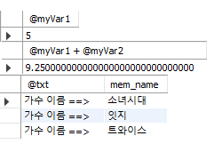

- `LIMIT`에는 변수를 사용할 수 없다
  - 이를 해결하기 위해 `PREPARE`, `EXECUTE`를 사용한다.

```SQL
SET @count = 3;
PREPARE mySQL FROM 'SELECT mem_name, height FROM member ORDER BY height LIMIT ?';
EXECUTE mySQL USING @count;
```

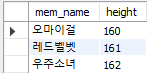

### 3. 데이터 형 변환

> 직접 함수를 사용해 변환하는 명시적인 변환
>
> 별도의 지시 없이 자연스럽게 변환되는 암시적인 변환

#### 1) 명시적인 변환

- 기본 형식

```SQL
CAST (값 AS 데이터_형식 [(길이)])
CONVERT (값, 데이터_형식 [(길이)])
```

```SQL
SELECT AVG(price) AS '평균 가격' FROM buy;
# 142.9167
```

```SQL
SELECT AVG(price) AS '평균 가격' FROM buy;
# OR
SELECT CONVERT(AVG(price) , SIGNED) '평균 가격' FROM buy;
# 143
```

- `CAST()`함수는 정수를 문자로 변환이 가능하다.
  - `CONCAT()`함수를 이용해 문자를 이어줄 수 있다.


```SQL
SELECT num, CONCAT(CAST(price AS CHAR), 'X', CAST(amount AS CHAR), '=' )
	   '가격X수량', price*amount '구매액'
FROM buy;
```

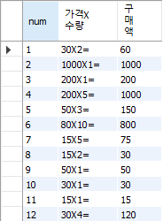

#### 2) 암시적인 변환

```SQL
SELECT '100' + '200'; # 300
SELECT CONCAT('100','200'); # 100200
SELECT CONCAT(100,'200'); # 100200
SELECT 100+'200'; # 300
```


## 2. 두 테이블을 묶는 조인

### 1. 내부 조인

- 기본 형식

```SQL 
SELECT <열 목록>
FROM <첫 번째 테이블>
	INNER JOIN <두 번째 테이블>
	ON <조인될 조건>
[WHERE 검색 조건]
```

```SQL
USE market_db;
SELECT * 
	FROM buy
    INNER JOIN member
    ON buy.mem_id = member.mem_id
where buy.mem_id = 'GRL';
```

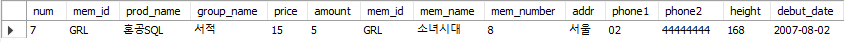

- `where buy.mem_id = 'GRL';` 생략 시

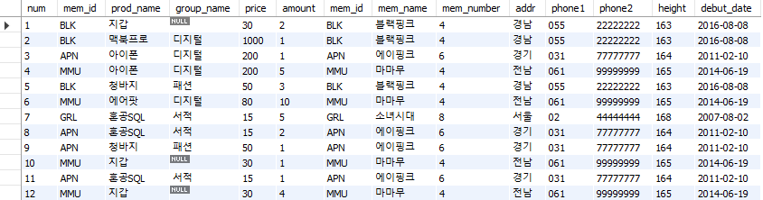

- 내부 조인의 간결한 표현
  - `mem_id`를 사용할 경우 회원, 구매 테이블에 모두 있어 오류 발생한다.

```SQL
SELECT buy.mem_id, mem_name, prod_name, addr, CONCAT(phone1, phone2) '연락처'
	FROM buy
		INNER JOIN member
		ON buy.mem_id = member.mem_id;
```

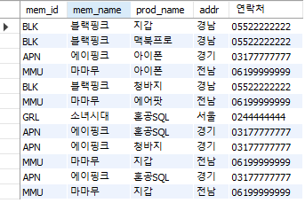

- 코드가 너무 길어져 복잡해 보이기 때문에 테이블 이름에 별칭을 붙일 수 있다.

```SQL
SELECT B.mem_id, M.mem_name, B.prod_name, M.addr, CONCAT(M.phone1, M.phone2) '연락처'
	FROM buy B
		INNER JOIN member M
		ON B.mem_id = M.mem_id;
```

- 내부 조인의 활용

```SQL
SELECT B.mem_id, M.mem_name, B.prod_name, M.addr
	FROM buy B
		INNER JOIN member M
		ON B.mem_id = M.mem_id
	ORDER BY M.mem_id;
```

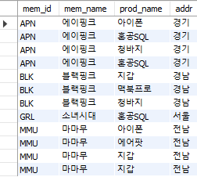

#### ※ 중복된 결과 1개만 출력

```SQL
SELECT DISTINCT M.mem_id, M.mem_name, M.addr
	FROM buy B
		INNER JOIN member M
		ON B.mem_id = M.mem_id
	ORDER BY M.mem_id;
```

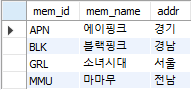

### 2. 외부 조인

> 필요한 내용이 한쪽 테이블에만 있어도 결과를 추출할 수 있다.

- 기본 형식

```SQL
SELECT <열 목록>
FROM <첫 번째 테이블(LEFT 테이블)>
	<LEFT|RIGHT|FULL> OUTER JOIN <두 번째 테이블(RIGHT 테이블)>
	ON <조인될 조건>
[WHERE 검색 조건];
```

- 예시

```SQL
SELECT M.mem_id, M.mem_name, B.prod_name, M.addr
	FROM member M
		LEFT OUTER JOIN buy B
		ON M.mem_id = B.mem_id
	ORDER BY M.mem_id;
```

```SQL
SELECT M.mem_id, M.mem_name, B.prod_name, M.addr
	FROM buy B
		RIGHT OUTER JOIN member M
		ON M.mem_id = B.mem_id
	ORDER BY M.mem_id;
```

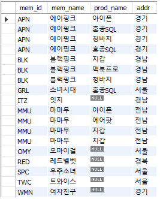

- 외부 조인의 활용
  - 구매 기록이 없는 회원 목록

```SQL
SELECT DISTINCT M.mem_id,B.prod_name, M.mem_name, M.addr
	FROM member M
		LEFT OUTER JOIN buy B
		ON M.mem_id = B.mem_id
	WHERE B.prod_name IS NULL
	ORDER BY M.mem_id;
```

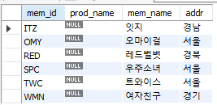

### 3. 기타 조인

#### 1) 상호 조인

> 한쪽 테이블의 모든 행과 다른 쪽 모든 행을 조인시키는 기능을 말한다. 상호 조인 결과의 전체 행의 개수는 두 테이블의 각 행의 개수를 곱한 개수가 된다.

- 특징
  - ON 구문을 사용할 수 없다.
  - 결과의 내용은 의미가 없다. 랜덤으로 조인하기 때문.
  - 상호 조인의 주 용도는 테스트하기 위해 대용량의 데이터를 생성할 때.

```SQL
SELECT * 
	FROM buy
		CROSS JOIN member;
```

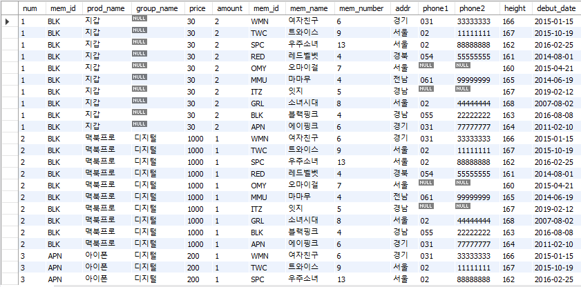

- 대용량의 테이블을 만들고 싶을 경우 `CREATE TABLE ~ SELECT`문을 사용

```SQL
CREATE TABLE cross_table
	SELECT * 
		FROM sakila.actor
			CROSS JOIN world.county;
SELECT * FROM cross_table LIMIT 5;
```

#### 2) 자체 조인

> 자신이 자신과 조인하는 의미. 대표적인 사례로 회사의 조직 관계를 살펴볼 수 있다.

- 기본 형식

```SQL
SELECT <열 목록>
FROM <테이블> 별칭A
	INNER JOIN <테이블> 별칭 B
	ON <조인될 조건>
[WHERE 검색 조건]
```

```SQL
SELECT A.emp "직원", B.emp "직속상관", B.phone "직속상관연락처"
	FROM emp_table A
		INNER JOIN emp_table B
        ON A.manager = B.emp
	WHERE A.emp = '경리부장';
```


## 3. SQL 프로그래밍

> `스토어드 프로시저`sms `MySQL`에서 프로그래밍 기능이 필요할 때 사용하는 데이터베이스 개체이다. SQL 프로그래밍은 기본적으로 스토어드 프로시저 안에 만들어야 한다.

- 기본 형식

```SQL
DELIMITER $$
CREATE PROCEDURE 스토어드_프로시저_이름()
BEGIN
	# SQL 프로그래밍 코딩
END $$
DELIMITER;
CALL 스토어드_프로시저_이름()
```

### 1. IF문

- 기본 형식
  - 'SQL 문장들'의 경우 한 문장이면 써도 되지만, 두 문장 이상이 처리되어야 할 때는 BEGIN ~ END로 묶어줘야 한다.

```SQL
IF <조건식> THEN
	SQL 문장들
END IF;
```

- 예시

```SQL
DROP PROCEDURE IF EXISTS ifProc1;
DELIMITER $$
CREATE PROCEDURE ifProc1()
BEGIN
	IF 100 = 100 THEN
		SELECT '100은 100과 같습니다.';
	END IF;
END $$
DELIMITER ;
CALL ifProc1();
```

- IF ~ ELSE 문

```SQL
DROP PROCEDURE IF EXISTS ifProc2;
DELIMITER $$
CREATE PROCEDURE ifProc2()
BEGIN
	DECLARE myNum INT;
	SET myNum = 200;
	IF myNum = 100 THEN
		SELECT '100입니다.';
	ELSE
		SELECT '100 아닙니다.';
	END IF;
END $$
DELIMITER ;
CALL ifProc2();
```

- IF문의 활용

```SQL
DROP PROCEDURE IF EXISTS ifProc3;
DELIMITER $$
CREATE PROCEDURE ifProc3()
BEGIN
	DECLARE debutDate DATE; -- 데뷔 일자
	DECLARE curDate DATE; -- 오늘
	DECLARE days INT; -- 활동한 일수
    
    SELECT debut_date INTO debutDate -- 변수 저장
    	FROM market_db.member
    	WHERE mem_id = 'APN';
    
	SET curDATE = CURRENT_DATE(); -- 현재 날짜 저장
	SET days = DATEDIFF(curDATE, debutDate); -- 날짜의 차이, 일 단위
	
	IF (days/365) >= 5 THEN -- 5년 이상일 경우
		SELECT CONCAT('데뷔한 지 ',days, '지났습니다.');
	ELSE -- 5년 미만일 경우
		SELECT '데뷔한 지 '+days+'일 밖에 안되었습니다.';
	END IF;
END $$
DELIMITER ;
CALL ifProc3();
```


### 2. CASE 문

- 기본 형식

```sql
CASE
	WHEN 조건1 THEN
		SQL문장들1
	WHEN 조건2 THEN
		SQL문장들2
	WHEN 조건3 THEN
		SQL문장들3
	ELSE
		SQL문장들4
END CASE;
```

- 예시
  - 성적
  - 구매액에 따른 회원 등급 구별

```SQL
DROP PROCEDURE IF EXISTS caseProc;
DELIMITER $$
CREATE PROCEDURE caseProc()
BEGIN
	DECLARE point INT;
	DECLARE credit CHAR(1);
	SET point = 88;
	
	CASE
		WHEN point >= 90 THEN
			SET credit = 'A';
		WHEN point >= 80 THEN
			SET credit = 'B';
		WHEN point >= 70 THEN
			SET credit = 'C';
		WHEN point >= 60 THEN
			SET credit = 'D';
		ELSE
        	SET credit = 'F';
    END CASE;
    SELECT CONCAT('취득점수 ==>',point), CONCAT('학점 ==>',credit); 
END $$
DELIMITER ;
CALL caseProc();
```


```SQL
SELECT M.mem_id, M.mem_name, SUM(price*amount) "총 구매액",
		CASE
			WHEN (SUM(price*amount) >= 1500) THEN '최우수고객'
            WHEN (SUM(price*amount) >= 1000) THEN '우수고객'
            WHEN (SUM(price*amount) >= 1) THEN '일반고객'
			ELSE '유령고객'
		END "회원 등급"
	FROM buy B
		RIGHT OUTER JOIN member M
        ON B.mem_id = M.mem_id
    GROUP BY M.mem_id
    ORDER BY SUM(price*amount) DESC ;
```

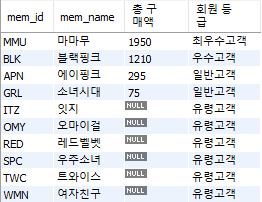

### 3. WHILE 문

- 기본 형식
  - ITERATE[레이블] : 지정한 레이블로 가서 계속 진행합니다.
  - LEAVE[레이블] : 지정한 레이블을 빠져나갑니다. `WHILE` 문 종료

```SQL
WHILE <조건식> DO
	SQL 문장들
END WHILE;
```

- 1~100의 값을 더하는 기능

```SQL
DROP PROCEDURE IF EXISTS whileProc;
DELIMITER $$
CREATE PROCEDURE whileProc()
BEGIN
	DECLARE i INT;
	DECLARE hap INT;
	SET i = 1;
	SET hap = 0;
	
	WHILE (i <= 100) DO
		SET hap = hap +i;
		SET i = i + 1;
	END WHILE;
	SELECT '1부터 100까지의 합 ==>', hap;
END $$
DELIMITER ;
CALL whileProc();
```


```SQL
DROP PROCEDURE IF EXISTS whileProc2;
DELIMITER $$
CREATE PROCEDURE whileProc2()
BEGIN
	DECLARE i INT;
	DECLARE hap INT;
	SET i = 1;
	SET hap = 0;
	
	myWhile: -- 
	WHILE (i <= 100) DO
		IF (i%4 =0) THEN -- 4의 배수일 경우 i만 증가
			SET i = i + 1;
			ITERATE myWhile; -- myWhile 문으로 가서 진행
		END IF;
		SET hap = hap +i;
		IF (hap > 1000) THEN
			LEAVE myWhile;
		END IF;
		SET i = i+1;
	END WHILE;
	SELECT '1부터 100까지의 합(4의 배수 제외), 1000 넘으면 종료 ==>', hap;
END $$
DELIMITER ;
CALL whileProc2();
```

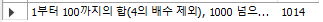

### 4. 동적 SQL의 활용

- `PREPARE`와 `EXECUTE`

> `PREPARE`는 SQL 문을 실행하지 않고 미리 준비, `EXECUTE`는 준비한 SQL문을 실행한다. 실행 후 `DEALLOCATE PREFARE`로 문장을 해제해주는 것이 바람직하다.

- 동적 SQL의 활용

> `PREPARE`는 ?로 향후에 입력될 값을 비워 놓고, `EXECUTE`는 `USING`으로 ?에 값을 전달할 수 있다. 실시간으로 필요한 값들을 전달해 동적으로 SQL이 실행된다.

```SQL
DROP TABLE IF EXISTS gate_table;
CREATE TABLE gate_table (id INT AUTO_INCREMENT PRIMARY KEY, entry_time DATETIME);

SET @curDate = CURRENT_TIMESTAMP();

PREPARE myQuery FROM 'INSERT INTO gate_table VALUES(NULL,?)';
EXECUTE myQuery USING @curDate
DEALLOCATE PREPARE myQuery;

SELECT * FROM gate_table;
```

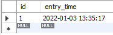
