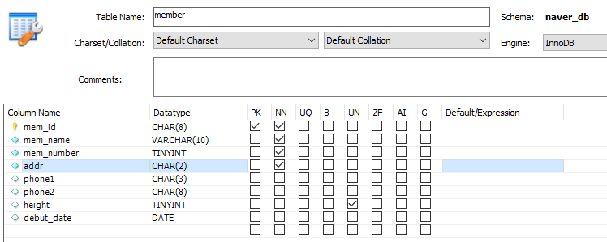
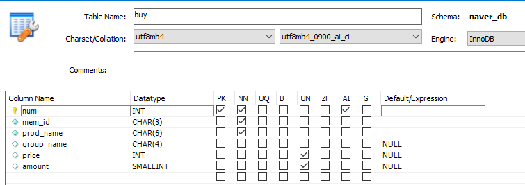
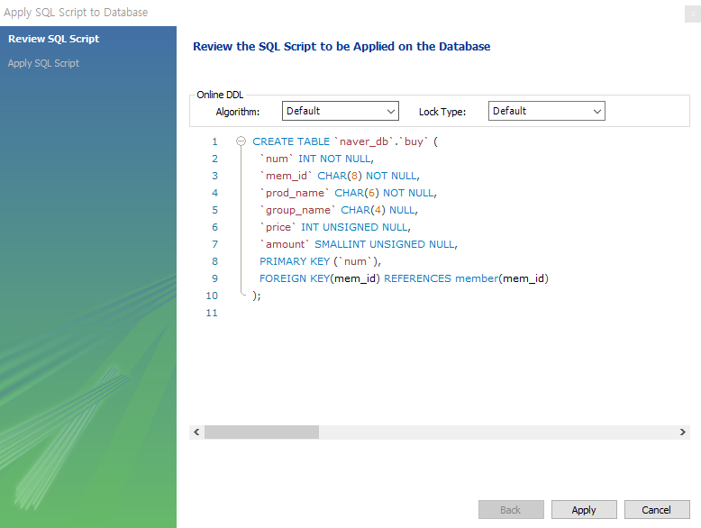
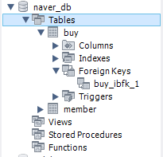
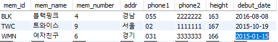
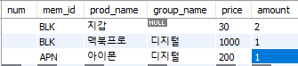

# 테이블과 뷰

# 1. 테이블 만들기

> 테이블은 표 형태로 구성된 2차원 구조. 
>
> 행 : 로우(row)나 레코드(record)
>
> 얄 : 컬럼(column) 또는 필드(field)

### 1. GUI 환경에서 테이블 만들기

#### ① 데이터 베이스 생성

```sql
create database naver_db;
```

#### ② 테이블 생성하기

- `member.height`, `buy.price`, `buy.amount`의 경우 음수 값이 없기 때문에 UN을 체크한다.
- AI는 Auto Increment로 자동으로 증가



- GUI에서는 기본키 - 외래 키 관계를 선택할 수 없기 때문에 코드를 수정해야 한다.


 

#### ③ 데이터 입력하기

- `[Result Grid]` 창의 Insert new row 아이콘을 클릭해서 행을 입력



- 이 경우 오류가 발생한다.
  - 회원 테이블과 구매 테이블이 기본키 - 외래 키로 연결되어 있기 때문

### 2. SQL로 테이블 만들기

#### ① 데이터 베이스 생성하기

```SQL
DROP DATABASE IF EXISTS naver_db;
CREATE DATABASE naver_db;
```

#### ② 테이블 생성하기

- 회원 테이블

```SQL
USE naver_db;
DROP TABLE IF EXISTS member;
CREATE TABLE member -- 회원 테이블
( mem_id		CHAR(8) NOT NULL PRIMARY KEY,
  mem_name		VARCHAR(10) NOT NULL,
  mem_number 	TINYINT NOT NULL,
  addr			CHAR(2) NOT NULL,
  phone1		CHAR(3) NULL,
  phone2		CHAR(8) NULL,
  height		TINYINT UNSIGNED NULL,
  debut_date	DATE NULL
);
```

- 구매 테이블

```SQL
DROP TABLE IF EXISTS buy;
CREATE TABLE buy -- 구매 테이블
( num			INT AUTO_INCREMENT NOT NULL PRIMARY KEY,
  mem_id		CHAR(8) NOT NULL,
  prod_name 	CHAR(6) NOT NULL,
  group_name 	CHAR(4) NULL,
  price 		INT UNSIGNED NOT NULL,
  amount 		SMALLINT UNSIGNED NOT NULL,
  FOREIGN KEY(mem_id) REFERENCES member(mem_id)
);
```

#### ③ 데이터 입력하기

- 회원 테이블 입력

```SQL
INSERT INTO member VALUES('TWC','트와이스',9,'서울','02','1111111',167,'2015-10-19');
INSERT INTO member VALUES('BLK','블랙핑크',4,'경남','055','2222222',163,'2016-8-8');
INSERT INTO member VALUES('WMN','여자친구',6,'경기','031','3333333',166,'2015-1-15');
```

- 구매 테이블 입력

```SQL
INSERT INTO buy VALUES(NULL,'BLK','지갑',NULL,30,2);
INSERT INTO buy VALUES(NULL,'BLK','맥북프로','디지털',1000,1);
```


# 2. 제약조건으로 테이블을 견고하게

> 기본 키와 외래 키가 대표적인 제약조건으로 기본 키는 학번, 아이디, 사번 등과 같은 고유 번호를 의미하는 열, 외래 키는 기본 키와 연결되는 열에 지정한다.
>
> - `MySQL`에서 제공하는 대표적인 제약조건
>   - PRIMARY KEY 제약조건
>   - FOREIGN KEY 제약조건
>   - UNIQUE 제약조건
>   - CHECK 제약조건
>   - DEFAULT 정의
>   - NULL 값 허용

# 3. 가상의 테이블 : 뷰


