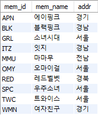
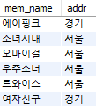
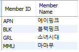
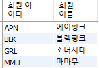
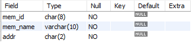
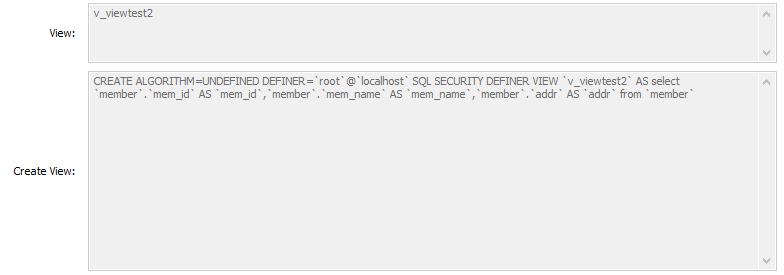
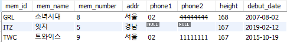
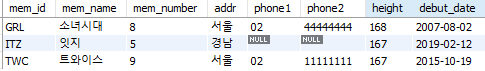
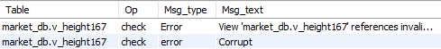
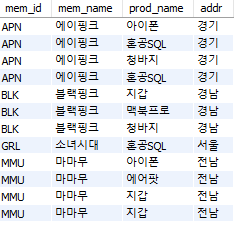

# 테이블과 뷰

# 1. 테이블 만들기

> 테이블은 표 형태로 구성된 2차원 구조. 
>
> 행 : 로우(row)나 레코드(record)
>
> 얄 : 컬럼(column) 또는 필드(field)

### 1. GUI 환경에서 테이블 만들기

#### ① 데이터 베이스 생성

```sql
create database naver_db;
```

#### ② 테이블 생성하기

- `member.height`, `buy.price`, `buy.amount`의 경우 음수 값이 없기 때문에 UN을 체크한다.
- AI는 Auto Increment로 자동으로 증가


- GUI에서는 기본키 - 외래 키 관계를 선택할 수 없기 때문에 코드를 수정해야 한다.


 

#### ③ 데이터 입력하기

- `[Result Grid]` 창의 Insert new row 아이콘을 클릭해서 행을 입력


- 이 경우 오류가 발생한다.
  - 회원 테이블과 구매 테이블이 기본키 - 외래 키로 연결되어 있기 때문

### 2. SQL로 테이블 만들기

#### ① 데이터 베이스 생성하기

```SQL
DROP DATABASE IF EXISTS naver_db;
CREATE DATABASE naver_db;
```

#### ② 테이블 생성하기

- 회원 테이블

```SQL
USE naver_db;
DROP TABLE IF EXISTS member;
CREATE TABLE member -- 회원 테이블
( mem_id		CHAR(8) NOT NULL PRIMARY KEY,
  mem_name		VARCHAR(10) NOT NULL,
  mem_number 	TINYINT NOT NULL,
  addr			CHAR(2) NOT NULL,
  phone1		CHAR(3) NULL,
  phone2		CHAR(8) NULL,
  height		TINYINT UNSIGNED NULL,
  debut_date	DATE NULL
);
```

- 구매 테이블

```SQL
DROP TABLE IF EXISTS buy;
CREATE TABLE buy -- 구매 테이블
( num			INT AUTO_INCREMENT NOT NULL PRIMARY KEY,
  mem_id		CHAR(8) NOT NULL,
  prod_name 	CHAR(6) NOT NULL,
  group_name 	CHAR(4) NULL,
  price 		INT UNSIGNED NOT NULL,
  amount 		SMALLINT UNSIGNED NOT NULL,
  FOREIGN KEY(mem_id) REFERENCES member(mem_id)
);
```

#### ③ 데이터 입력하기

- 회원 테이블 입력

```SQL
INSERT INTO member VALUES('TWC','트와이스',9,'서울','02','1111111',167,'2015-10-19');
INSERT INTO member VALUES('BLK','블랙핑크',4,'경남','055','2222222',163,'2016-8-8');
INSERT INTO member VALUES('WMN','여자친구',6,'경기','031','3333333',166,'2015-1-15');
```

- 구매 테이블 입력

```SQL
INSERT INTO buy VALUES(NULL,'BLK','지갑',NULL,30,2);
INSERT INTO buy VALUES(NULL,'BLK','맥북프로','디지털',1000,1);
```


# 2. 제약조건으로 테이블을 견고하게

> 기본 키와 외래 키가 대표적인 제약조건으로 기본 키는 학번, 아이디, 사번 등과 같은 고유 번호를 의미하는 열, 외래 키는 기본 키와 연결되는 열에 지정한다.
>
> - `MySQL`에서 제공하는 대표적인 제약조건
>   - PRIMARY KEY 제약조건
>   - FOREIGN KEY 제약조건
>   - UNIQUE 제약조건
>   - CHECK 제약조건
>   - DEFAULT 정의
>   - NULL 값 허용

### 1. 기본 키 제약조건

#### ① CREATE TABLE에서 설정하는 기본 키 제약조건

- `PRIMARY KEY` 예약어 입력 방법

```sql
USE naver_db;
DROP TABLE IF EXISTS buy, member;
CREATE TABLE member
( mem_id	CHAR(8) NOT NULL PRIMARY KEY,
  mem_name	VARCHAR(10) NOT NULL,
  height 	TINYINT UNSIGNED NULL
);
```

- 마지막 행에 `PRIMARY KEY` 추가

```SQL
DROP TABLE IF EXISTS member;
CREATE TABLE member
( mem_id	CHAR(8) NOT NULL,
  mem_name	VARCHAR(10) NOT NULL,
  height 	TINYINT UNSIGNED NULL,
  PRIMARY KEY (mem_id)
);
```

#### ② ALTER TABLE에서 설정하는 기본 키 제약조건

- 이미 만들어진 테이블을 수정하는 `ALTER TABLE` 구문을 사용

```SQL
DROP TABLE IF EXISTS member;
CREATE TABLE member
( mem_id	CHAR(8) NOT NULL,
  mem_name	VARCHAR(10) NOT NULL,
  height 	TINYINT UNSIGNED NULL,
);
ALTER TABLE member 			-- member 변경
	ADD CONSTRAINT 			--
	PRIMARY KEY (mem_id);	-- mem_id 열에 기본 키 제약조건 설정
```

#### ※ 기본 키에 이름 지정

> 기본 키는 별도의 이름이 없으며, DESCRIBE 명령으로 확인하면 그냥 PRI로만 나온다. 필요하다면 기본 키의 입력을 지어 줄 수 있다.

```SQL
DROP TABLE IF EXISTS member;
CREATE TABLE member
( mem_id	CHAR(8) NOT NULL,
  mem_name	VARCHAR(10) NOT NULL,
  height 	TINYINT UNSIGNED NULL,
  CONSTRAINT PRIMARY KEY PK_member_mem_id (mem_id)
);
```

### 2. 외래 키 제약조건

> 외래 키 제약조건으느 두 테이블 사이의 관계를 연결, 그 결과 데이터의 무결성을 보장해주는 역할을 한다. 외래 키가 설정된 열은 꼭 다른 테이블의 기본 키와 연결된다.

#### ① CREATE TABLE에서 설정하는 외래 키 제약조건

```SQL
DROP TABLE IF EXISTS buy, member;
CREATE TABLE member
( mem_id		CHAR(8) NOT NULL PRIMARY KEY,
  mem_name 		VARCHAR(10) NOT NULL,
  height 		TINYINT UNSIGNED NULL
);

CREATE TABLE buy
( num 			INT AUTO_INCREMENT NOT NULL PRIMARY KEY,
  mem_id 		CHAR(8) NOT NULL,
  prod_name 	CHAR(6) NOT NULL,
  FOREIGN KEY(mem_id) REFERENCES member(mem_id)
);
```

> 이때 기준 테이블의 mem_id와 참조 테이블의 mem_id가 같은데 동일하지 않아도 된다.
>
> 즉 member.mem_name과 buy.user_id 와 같은 형식으로 진행해도 문제가 발생하지 않는다.

#### ② ALTER TABLE에서 설정하는 기본 키 제약조건

```SQL
DROP TABLE IF EXISTS buy;
CREATE TABLE buy
( num 		INT AUTO_INCREMENT NOT NULL PRIMARY KEY,
  mem_id 	CHAR(8) NOT NULL,
  prod_name CHAR(6) NOT NULL,
);
ALTER TABLE buy
	ADD CONSTRAINT
    FOREIGN KEY (mem_id)
	REFERENCES member(mem_id);	
```

#### ③ 기준 테이블의 열이 변경될 경우

- 기준 테이블에서 기본 키 - 외래 키로 맺어진 후에는 기준 테이블의 열 이름이 변경되지 않는다. 삭제 또한 불가능하다.
- 이런 기능을 지원하는 것이 `ON UPDATE CASCADE` 문이다. `ON DELETE CASCADE`문은 기준 테이블의 데이터 삭제시 참조 테이블의 데이터도 삭제되는 기능이다.

```SQL
DROP TABLE IF EXISTS buy;
CREATE TABLE buy
( num 		INT AUTO_INCREMENT NOT NULL PRIMARY KEY,
  mem_id 	CHAR(8) NOT NULL,
  prod_name CHAR(6) NOT NULL,
);
ALTER TABLE buy
	ADD CONSTRAINT
    FOREIGN KEY (mem_id) REFERENCES member(mem_id)
    ON UPDATE CASCADE
    ON DELETE CASCADE;
```


### 3. 기타 제약조건

#### ① 고유 키 제약조건

> 고유 키 제약조건은 '중복되지 않는 유일한 값'을 입력해야 하는 조건. 기본 키 제약조건과 거의 비슷하지만, 고유 키 제약조건은 `NULL` 값을 허용한다. 또 기본 키는 테이블에 1개만 설정해야 하지만, 고유 키는 여러 개를 설정해도 된다.
>
> - `UNIQUE은 NULL은 허용하지만 중복은 허용하지 않는다.

```SQL
DROP TABLE IF EXISTS buy, member;
CREATE TABLE member
( mem_id	CHAR(8) NOT NULL PRIMARY KEY,
  mem_name	VARCHAR(10) NOT NULL,
  height	TINYINT UNSIGNED NULL,
  email		CHAR(30) NULL UNIQUE
);
```

```SQL
INSERT INTO member VALUES ('BLK','블랙핑크',163,'pink@gmail.com');
INSERT INTO member VALUES ('TWC','트와이스',167, NULL);
INSERT INTO member VALUES ('APN','에이핑크',164,'pink@gmail.com'); -- 오류 발생
```

#### ② 체크 제약조건

> 체크 제약조건은 입력되는 데이터를 점검하는 기능을 한다. 예를 들어 평균 키에 마이너스 값이 입력되지 않도록 하거나, 연락처에 국번에 02, 031, 041, 055 중 하나만 입력되도록 할 수 있다.
>
> 테이블을 정의하면서 열의 정의 뒤에 `CHECK`을 추가한다.

```SQL
DROP TABLE IF EXISTS member;
CREATE TABLE member
( mem_id 	CHAR(8) NOT NULL PRIMARY KEY,
  mem_name 	VARCHAR(10) NOT NULL,
  height 	TINYINT UNSIGNED NULL CHECK (height >=100),
  phone1 	CHAR(3) NULL
);
```

```SQL
INSERT INTO member VALUES('BLK','블랙핑크',163,NULL);
INSERT INTO member VALUES('TWC','트와이스',99,NULL); -- ERROR 발생
```

- 필요하다면 `ALTER TABLE`를 이용해 제약조건 추가 가능

```SQL
ALTER TABLE member
	ADD CONSTRAINT
	CHECK (phone1 IN ('02','031','032','054','055','061'));
```

```SQL
INSERT INTO member VALUES('BLK','블랙핑크',163,'02');
INSERT INTO member VALUES('TWC','트와이스',167,'010'); -- ERROR 발생
```


#### ③ 기본값 정의

> 입력하지 않았을 때 자동으로 입력될 값을 미리 지정해 놓는 방법

```SQL
DROP TABLE IF EXISTS member;
CREATE TABLE member
( mem_id 	CHAR(8) NOT NULL PRIMARY KEY,
  mem_name 	VARCHAR(10) NOT NULL,
  height 	TINYINT UNSIGNED NULL DEFAULT 160,
  phone1 	CHAR(3) NULL
);
ALTER TABLE member
	ALTER COLUMN phone1 SET DEFAULT '02';
```

```SQL
INSERT INTO member VALUES('RED','레드벨벳',161,'054');
INSERT INTO member VALUES('SPC','우주소녀',default,default);
SELECT * FROM member;
```


#### ④ 널 값 허용

> NULL을 허용할 경우 NULL, 허용하지 않을 경우 NOT NULL 사용. PRIMARY KEY가 설정된 열에는 NULL 값이 있을 수 없으므로 생략하면 자동으로 NOT NULL로 인식. 
>
> **NULL은 공백(' ')이나 0과는 다르다는 점을 인지!**


# 3. 가상의 테이블 : 뷰

> 뷰는 '가상의 테이블'이라 부른다. **데이터베이스 개체** 중 하나로 테이블과 거의 동일한 개체로 취급한다. 뷰는 **단순 뷰**와 **복합 뷰**로 나뉘는데, 단순 뷰는 하나의 테이블과 연관된 뷰를 말하고, 복합 뷰는 2개 이상의 테이블과 연관된 뷰를 말한다.

### 1. 뷰의 개념

- 기본 형식
  - 뷰에 접근하는 방식은 테이블과 동일하게 `SELECT`문을 사용

```sql
CREATE VIEW 뷰_이름
AS
 SELECT 문;
```

```sql
SELECT 열_이름 FROM 뷰_이름
	[WHERE 조건];
```
  - 회원 테이블의 아이디, 이름, 주소에 접근하는 뷰 생성

```SQL
USE market_db;
CREATE VIEW v_member
AS
	SELECT mem_id, mem_name, addr FROM member;
	
SELECT * FROM v_member;
```

```SQL
SELECT mem_name, addr FROM v_member
	WHERE addr IN ('서울','경기');
```

  

#### ① 뷰의 장점

1. 보안에 도움이 된다.
> 중요정보를 제외한 뷰를 생성해 테이블 접근 권한을 제한하고, 뷰에만 접근할 수 있도록 권한을 주어 보안을 강화한다.
2. 복잡한 SQL을 단순하게 만들 수 있다.
> SQL을 뷰로 생성해 놓고 사용자들은 해당 뷰에 접근하도록 해 복잡한 SQL을 입력할 필요를 없게한다.


### 2. 뷰의 실제 작동

#### ① 뷰의 실제 생성, 수정, 삭제

> 뷰에 사용될 열 이름을 테이블과 다르게 지정할 수 있다. **별칭**을 사용하게 되는데, 중간에 띄어쓰기 사용이 가능하다. 별칭은 열 이름 뒤에 작은따옴표, 큰 따옴표로 묶어주고, 형식상 **AS**를 붙여준다. AS를 붙이면 코드가 명확해 보이는 장점이 있다.
>
> 단, 뷰를 조회할 때 열 이름에 공백이 있으면 백틱(**`**) 으로 묶어줘야 한다. 열 이름에 한글을 사용도 가능하지만 한글 운영 체제 외에는 인식 불가할 수도 있다.

```SQL
USE market_db;
CREATE VIEW v_viewtest1
AS
	SELECT B.mem_id 'Member ID', M.mem_name AS 'Member Name', 
		B.prod_name 'Product_Name', 
			CONCAT(M.phone1, M.phone2) AS "Office Phone"
		FROM buy B
			INNER JOIN member M
			ON B.mem_id = M.mem_id;
SELECT DISTINCT `Member ID`, `Member Name` FROM v_viewtest1; -- 백틱 사용
```
- 뷰의 수정
```SQL
ALTER VIEW v_viewtest1
AS
	SELECT B.mem_id '회원 아이디', M.mem_name AS '회원 이름', 
		B.prod_name '제품 이름', 
			CONCAT(M.phone1, M.phone2) AS "연락처"
		FROM buy B
			INNER JOIN member M
			ON B.mem_id = M.mem_id;
SELECT DISTINCT `회원 아이디`, `회원 이름` FROM v_viewtest1;
```
- 뷰의 삭제
```SQL
DROP VIEW v_viewtest1;
```
  

#### ② 뷰의 정보 확인

- `DESCRIBE` 문으로 기존 뷰의 정보를 확인할 수 있다.
  - 주의할 점은 `PRIMARY KEY`는 확인할 수 없다.

```SQL
USE market_db;
CREATE OR REPLACE VIEW v_viewtest2
AS
	SELECT mem_id, mem_name, addr FROM member;

DESCRIBE v_viewtest2;
DESCRIBE member;
```

  

- `SHOW CREATE VIEW`문으로 뷰의 소스 코드를 확인할 수 있다.
  - [Result Grid] 창, [Form Editor] 창에서 확인 가능



#### ③ 뷰를 통한 데이터의 수정/삭제

- 데이터 수정

```SQL
UPDATE v_member SET addr = '부산' WHERE mem_id ='BLK'
```

- 데이터 삭제

```SQL
CREATE VIEW v_height167
AS
	SELECT * FROM member WHERE height >= 167;
SELECT * FROM v_height167;
```



```SQL
DELETE FROM v_height167 WHERE height < 167;
```

#### ④ 뷰를 통한 데이터의 입력

```SQL
INSERT INTO v_height167 VALUES('TRA','티아라',6,'서울',NULL,NULL,159,'2005-01-01');
SELECT * FROM v_height167;
```



- 위의 DELETE 문에 의해 height = 159인 데이터는 확인 불가.
  - `WITH CHECK OPTION`을 통해 뷰에 설정된 값의 범위가 벗어나는 값은 입력되지 않도록 할 수 있다.

```SQL
ALTER VIEW v_height167
AS
	SELECT * FROM member WHERE height >=167
		WITH CHECK OPTION ;
INSERT INTO v_height167 VALUES('TOB','텔레토비',4,'영국',NULL,NULL,140,'1995-01-01');
```

```SQL
15:04:32	INSERT INTO v_height167 VALUES('TOB','텔레토비',4,'영국',NULL,NULL,140,'1995-01-01')	Error Code: 1369. CHECK OPTION failed 'market_db.v_height167'	0.000 sec
```

#### ⑤ 뷰가 참조하는 테이블의 삭제

```SQL
DROP TABLE IF EXISTS buy, member;
```

- 오류 메시지

```SQL
SELECT * FROM v_height167;
```

```SQL
15:09:16	SELECT * FROM v_height167 LIMIT 0, 1000	Error Code: 1356. View 'market_db.v_height167' references invalid table(s) or column(s) or function(s) or definer/invoker of view lack rights to use them	0.000 sec
```

- `CHECK TABLE` 문으로 뷰의 상태를 확인

```SQL
CHECK TABLE v_height167;
```



#### ※ 단순 뷰와 복합 뷰

- 복합 뷰

```SQL
CREATE VIEW v_complex
AS
	SELECT B.mem_id, M.mem_name, B.prod_name, M.addr
		FROM buy B
		 INNER JOIN member M
		 ON B.mem_id = M.mem_id;
```



