# 인덱스

## 1. 인덱스의 개념 파악

### 1. 인덱스 개념

#### ① 장점과 단점

- 장점
  - SELECT 문으로 검색하는 속도 향상
  - 컴퓨터의 부담이 줄어 전체 시스템의 성능 향상
- 단점
  - 인덱스로 인한 데이터베이스 안에 추가 공간 필요
  - 초기 인덱스 생성시 시간이 오래 걸릴 수 있다.
  - `SELECT`가 아닌 데이터의 변경 작업(`INSERT`, `UPDATE`, `DELETE`)이 자주 일어나면 성능 저하.

### 2. 인덱스의 종류

#### ① 자동으로 생성되는 인덱스

```sql
use market_db;
create table table1 (
 col1 int primary key,
 col2 int,
 col3 int
);

 show index from table1;
```

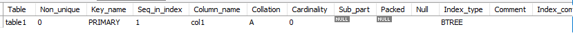

- `Key_name` 부분의 `PRIMARY`는 기본키로 설정해 '자동으로 생성된 인덱스'라는 의미. 이것이 **클러스터형 인덱스**.
- `Column_name`에 col1 설정된 것은 col1 열에 인덱스가 만들어졌다는 의미.
- `Non_unique`는 고유하지 않다는 의미로 중복이 허용되냐를 묻는다. 0은 `False` 1은 `True`를 의미로 해당 부분에서는 0으로 이 인덱스는 중복 허용되지 않는다.

```sql
create table table2 (
 col1 int primary key,
 col2 int unique,
 col3 int unique
 );
 show index from table2;
```

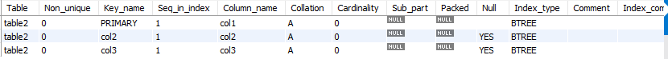

- 고유 키로 생성되는 인덱스는 보조 인덱스로 `Key_name`해당 열이름이 생성된다.
- `Non_unique`는 0으로 중복값을 허용하지 않으며 고유 키를 여러 개 지정할 수 있듯 보조 인덱스도 여러개 만들 수 있다.

#### ② 자동으로 정렬되는 클러스터형 인덱스

```sql
USE market_db;
DROP TABLE IF EXISTS buy, member;
CREATE TABLE member 
( mem_id      CHAR(8) , 
  mem_name    VARCHAR(10),
  mem_number  INT ,  
  addr        CHAR(2)  
 );

INSERT INTO member VALUES('TWC', '트와이스', 9, '서울');
INSERT INTO member VALUES('BLK', '블랙핑크', 4, '경남');
INSERT INTO member VALUES('WMN', '여자친구', 6, '경기');
INSERT INTO member VALUES('OMY', '오마이걸', 7, '서울');
SELECT * FROM member;
```
```sql
ALTER TABLE member
     ADD CONSTRAINT 
     PRIMARY KEY (mem_id);
SELECT * FROM member;
```

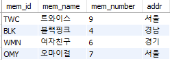 **→**  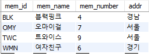

- `mem_id`열을 기본 키로 지정 후 알파벳 순서로 정렬된 것을 볼 수 있다.
  - 기본 키를 다른 열로 변경 할 경우 다시 정렬된다.
  - 추가로 데이터를 입력하면 기준에 맞춰 정렬된다.

```sql
ALTER TABLE member drop primary key;
ALTER TABLE member
     ADD CONSTRAINT 
     PRIMARY KEY (mem_name);
SELECT * FROM member;
```
```sql
INSERT INTO member VALUES('GRL', '소녀시대',8,'서울');
SELECT * FROM member;
```

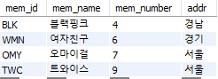  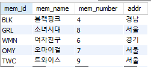

#### ③ 정렬되지 않는 보조 인덱스

- 회원 테이블의 열을 고유 키 없이 생성해본다.

```sql
USE market_db;
DROP TABLE IF EXISTS member;
CREATE TABLE member 
( mem_id      CHAR(8) , 
  mem_name    VARCHAR(10),
  mem_number  INT ,  
  addr        CHAR(2)  
 );
 
INSERT INTO member VALUES('TWC', '트와이스', 9, '서울');
INSERT INTO member VALUES('BLK', '블랙핑크', 4, '경남');
INSERT INTO member VALUES('WMN', '여자친구', 6, '경기');
INSERT INTO member VALUES('OMY', '오마이걸', 7, '서울');
SELECT * FROM member;
```

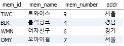

- 보조 인덱스를 생성해본다.
  - 보조 인덱스를 생성하더라도 데이터의 내용이나 순서는 변경되지 않는다.
  - 여러개의 보조 인덱스를 생성하더라도 내용이나 순서에 영향 X
  - 여러 보조 인덱스를 생성시 DB에 공간을 차지하기 때문에 꼭 필요한 열에만 보조 인덱스 생성

```sql
ALTER TABLE member
     ADD CONSTRAINT 
     UNIQUE (mem_id);
SELECT * FROM member;
```

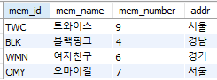

## 2. 인덱스의 내부 작동

### 1. 내부 작동 원리

#### ① **균형 트리**

> '자료 구조'에 나오는 범용적으로 사용되는 데이터의 구조
>
> - 노드 : 데이터가 저장되는 공간, `MySQL`에서는 `page(페이지)`라고 부르며 16Kbyte 크기를 갖는다.

- 리프 페이지만 있을 경우 MMM
  - AAA 부터 MMM까지 3개의 페이지(8개의 데이터)를 검색

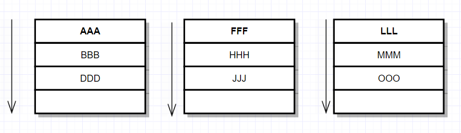

- 루트 페이지가 있을 경우 MMM
  - AAA, FFF, LLL 검색후 LLL, MMM 순으로 총 2개의 페이지(5개의 데이터)를 검색한다.


#### ② 균형 트리의 페이지 분할

> 인덱스를 구성하면 데이터 변경 작업(`INSERT`, `UPDATE`, `DELETE`) 시 성능이 나빠지는데 이 때 `INSERT` 작업이 일어날 때 더 느리게 **페이지 분할** 작업이 발생해 느리게 입력될 수 있다.

- 데이터 III를 위의 균형 트리에 입력할 경우 JJJ가 아래로 이동만 하면 된다.
  - 그러나 GGG를 입력할 경우 아래와 같이 페이지가 늘어난다.

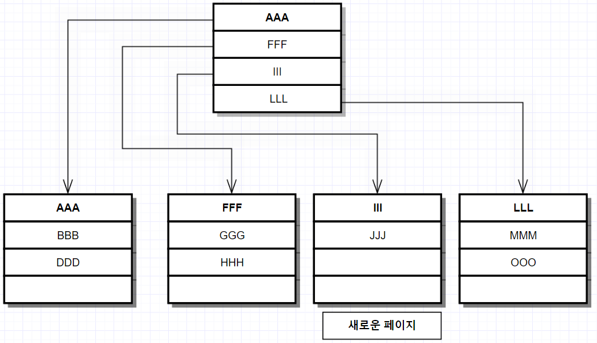

- PPP,QQQ 2개를 연속으로 입력한 경우 아래와 같이 변한다.
  - 2개의 데이터 입력에 3개의 페이지가 추가되고, 2회의 페이지 분할이 진행된다.
  - 기존의 루트 페이지는 중간 페이지가 되고 새로운 루트 페이지가 생성된다.

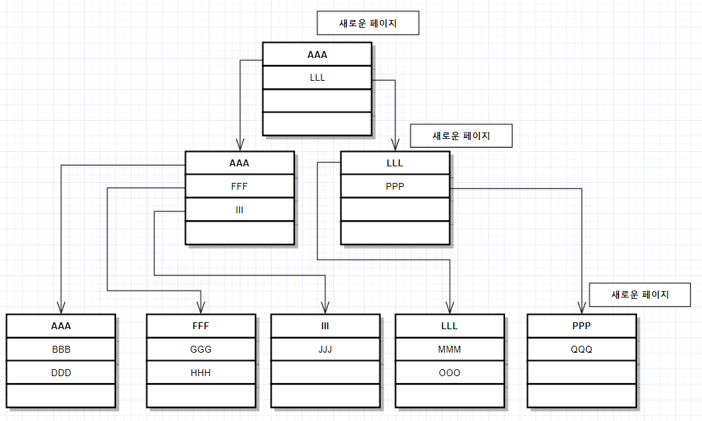

### 2.인덱스의 구조

#### ① 클러스터형 인덱스 구성

- 임의로 테이블 생성
- 인덱스 번호를 임의로 정하면 아래 그림과 같은 형태의 페이지로 이루어진다.

```SQL
USE market_db;
CREATE TABLE cluster  -- 클러스터형 테이블 
( mem_id      CHAR(8) , 
  mem_name    VARCHAR(10)
 );
INSERT INTO cluster VALUES('TWC', '트와이스');
INSERT INTO cluster VALUES('BLK', '블랙핑크');
INSERT INTO cluster VALUES('WMN', '여자친구');
INSERT INTO cluster VALUES('OMY', '오마이걸');
INSERT INTO cluster VALUES('GRL', '소녀시대');
INSERT INTO cluster VALUES('ITZ', '잇지');
INSERT INTO cluster VALUES('RED', '레드벨벳');
INSERT INTO cluster VALUES('APN', '에이핑크');
INSERT INTO cluster VALUES('SPC', '우주소녀');
INSERT INTO cluster VALUES('MMU', '마마무');
```
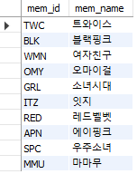 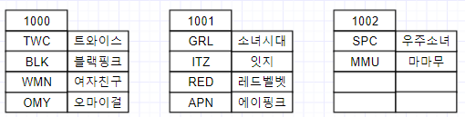

- mem_id를 `PRIMARY KEY`로 지정할 경우 테이블 정렬 후 균형 트리 형태의 인덱스 생성

```SQL
ALTER TABLE cluster
	ADD CONSTRAINT
	PRIMARY KEY (mem_id);
```
 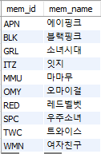  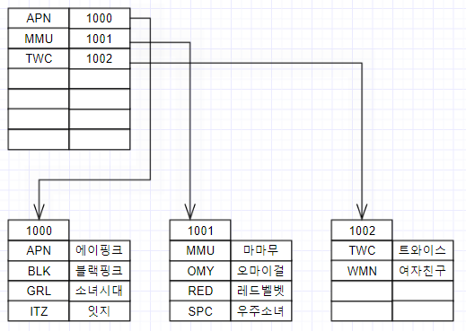

