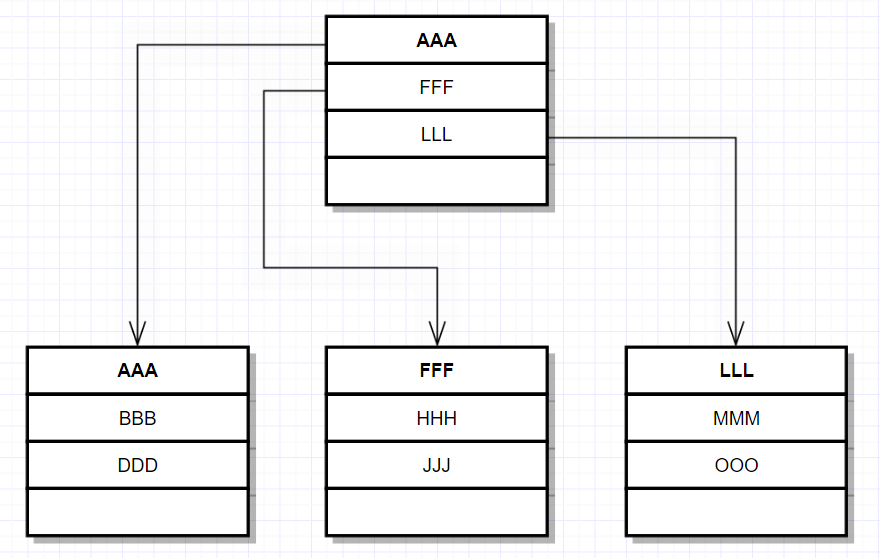
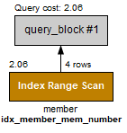
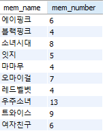

# 인덱스

## 1. 인덱스의 개념 파악

### 1. 인덱스 개념

#### ① 장점과 단점

- 장점
  - SELECT 문으로 검색하는 속도 향상
  - 컴퓨터의 부담이 줄어 전체 시스템의 성능 향상
- 단점
  - 인덱스로 인한 데이터베이스 안에 추가 공간 필요
  - 초기 인덱스 생성시 시간이 오래 걸릴 수 있다.
  - `SELECT`가 아닌 데이터의 변경 작업(`INSERT`, `UPDATE`, `DELETE`)이 자주 일어나면 성능 저하.

### 2. 인덱스의 종류

#### ① 자동으로 생성되는 인덱스

```sql
use market_db;
create table table1 (
 col1 int primary key,
 col2 int,
 col3 int
);

 show index from table1;
```


- `Key_name` 부분의 `PRIMARY`는 기본키로 설정해 '자동으로 생성된 인덱스'라는 의미. 이것이 **클러스터형 인덱스**.
- `Column_name`에 col1 설정된 것은 col1 열에 인덱스가 만들어졌다는 의미.
- `Non_unique`는 고유하지 않다는 의미로 중복이 허용되냐를 묻는다. 0은 `False` 1은 `True`를 의미로 해당 부분에서는 0으로 이 인덱스는 중복 허용되지 않는다.

```sql
create table table2 (
 col1 int primary key,
 col2 int unique,
 col3 int unique
 );
 show index from table2;
```


- 고유 키로 생성되는 인덱스는 보조 인덱스로 `Key_name`해당 열이름이 생성된다.
- `Non_unique`는 0으로 중복값을 허용하지 않으며 고유 키를 여러 개 지정할 수 있듯 보조 인덱스도 여러개 만들 수 있다.

#### ② 자동으로 정렬되는 클러스터형 인덱스

```sql
USE market_db;
DROP TABLE IF EXISTS buy, member;
CREATE TABLE member 
( mem_id      CHAR(8) , 
  mem_name    VARCHAR(10),
  mem_number  INT ,  
  addr        CHAR(2)  
 );

INSERT INTO member VALUES('TWC', '트와이스', 9, '서울');
INSERT INTO member VALUES('BLK', '블랙핑크', 4, '경남');
INSERT INTO member VALUES('WMN', '여자친구', 6, '경기');
INSERT INTO member VALUES('OMY', '오마이걸', 7, '서울');
SELECT * FROM member;
```
```sql
ALTER TABLE member
     ADD CONSTRAINT 
     PRIMARY KEY (mem_id);
SELECT * FROM member;
```

 **→**  

- `mem_id`열을 기본 키로 지정 후 알파벳 순서로 정렬된 것을 볼 수 있다.
  - 기본 키를 다른 열로 변경 할 경우 다시 정렬된다.
  - 추가로 데이터를 입력하면 기준에 맞춰 정렬된다.

```sql
ALTER TABLE member drop primary key;
ALTER TABLE member
     ADD CONSTRAINT 
     PRIMARY KEY (mem_name);
SELECT * FROM member;
```
```sql
INSERT INTO member VALUES('GRL', '소녀시대',8,'서울');
SELECT * FROM member;
```

  

#### ③ 정렬되지 않는 보조 인덱스

- 회원 테이블의 열을 고유 키 없이 생성해본다.

```sql
USE market_db;
DROP TABLE IF EXISTS member;
CREATE TABLE member 
( mem_id      CHAR(8) , 
  mem_name    VARCHAR(10),
  mem_number  INT ,  
  addr        CHAR(2)  
 );
 
INSERT INTO member VALUES('TWC', '트와이스', 9, '서울');
INSERT INTO member VALUES('BLK', '블랙핑크', 4, '경남');
INSERT INTO member VALUES('WMN', '여자친구', 6, '경기');
INSERT INTO member VALUES('OMY', '오마이걸', 7, '서울');
SELECT * FROM member;
```


- 보조 인덱스를 생성해본다.
  - 보조 인덱스를 생성하더라도 데이터의 내용이나 순서는 변경되지 않는다.
  - 여러개의 보조 인덱스를 생성하더라도 내용이나 순서에 영향 X
  - 여러 보조 인덱스를 생성시 DB에 공간을 차지하기 때문에 꼭 필요한 열에만 보조 인덱스 생성

```sql
ALTER TABLE member
     ADD CONSTRAINT 
     UNIQUE (mem_id);
SELECT * FROM member;
```


## 2. 인덱스의 내부 작동

### 1. 내부 작동 원리

#### ① **균형 트리**

> '자료 구조'에 나오는 범용적으로 사용되는 데이터의 구조
>
> - 노드 : 데이터가 저장되는 공간, `MySQL`에서는 `page(페이지)`라고 부르며 16Kbyte 크기를 갖는다.

- 리프 페이지만 있을 경우 MMM
  - AAA 부터 MMM까지 3개의 페이지(8개의 데이터)를 검색


- 루트 페이지가 있을 경우 MMM
  - AAA, FFF, LLL 검색후 LLL, MMM 순으로 총 2개의 페이지(5개의 데이터)를 검색한다.



#### ② 균형 트리의 페이지 분할

> 인덱스를 구성하면 데이터 변경 작업(`INSERT`, `UPDATE`, `DELETE`) 시 성능이 나빠지는데 이 때 `INSERT` 작업이 일어날 때 더 느리게 **페이지 분할** 작업이 발생해 느리게 입력될 수 있다.

- 데이터 III를 위의 균형 트리에 입력할 경우 JJJ가 아래로 이동만 하면 된다.
  - 그러나 GGG를 입력할 경우 아래와 같이 페이지가 늘어난다.


- PPP,QQQ 2개를 연속으로 입력한 경우 아래와 같이 변한다.
  - 2개의 데이터 입력에 3개의 페이지가 추가되고, 2회의 페이지 분할이 진행된다.
  - 기존의 루트 페이지는 중간 페이지가 되고 새로운 루트 페이지가 생성된다.


### 2.인덱스의 구조

#### ① 클러스터형 인덱스 구성

- 임의로 테이블 생성
- 인덱스 번호를 임의로 정하면 아래 그림과 같은 형태의 페이지로 이루어진다.

```SQL
USE market_db;
CREATE TABLE cluster  -- 클러스터형 테이블 
( mem_id      CHAR(8) , 
  mem_name    VARCHAR(10)
 );
INSERT INTO cluster VALUES('TWC', '트와이스');
INSERT INTO cluster VALUES('BLK', '블랙핑크');
INSERT INTO cluster VALUES('WMN', '여자친구');
INSERT INTO cluster VALUES('OMY', '오마이걸');
INSERT INTO cluster VALUES('GRL', '소녀시대');
INSERT INTO cluster VALUES('ITZ', '잇지');
INSERT INTO cluster VALUES('RED', '레드벨벳');
INSERT INTO cluster VALUES('APN', '에이핑크');
INSERT INTO cluster VALUES('SPC', '우주소녀');
INSERT INTO cluster VALUES('MMU', '마마무');
```
 

- mem_id를 `PRIMARY KEY`로 지정할 경우 테이블 정렬 후 균형 트리 형태의 인덱스 생성

```SQL
ALTER TABLE cluster
	ADD CONSTRAINT
	PRIMARY KEY (mem_id);
```
   

#### ② 보조 인덱스 구성

```sql
USE market_db;
DROP TABLE IF EXISTS second;
CREATE TABLE second 
( mem_id      CHAR(8) , 
  mem_name    VARCHAR(10)
 );
INSERT INTO second VALUES('TWC', '트와이스');
INSERT INTO second VALUES('BLK', '블랙핑크');
INSERT INTO second VALUES('WMN', '여자친구');
INSERT INTO second VALUES('OMY', '오마이걸');
INSERT INTO second VALUES('GRL', '소녀시대');
INSERT INTO second VALUES('ITZ', '잇지');
INSERT INTO second VALUES('RED', '레드벨벳');
INSERT INTO second VALUES('APN', '에이핑크');
INSERT INTO second VALUES('SPC', '우주소녀');
INSERT INTO second VALUES('MMU', '마마무');

ALTER TABLE second
	ADD CONSTRAINT
	UNIQUE (mem_id);
SELECT * FROM second;
```

> 보조 인덱스를 테스트하기 위한 테이블 생성
>
> - 고유 키 제약조건은 보조 인덱스를 생성하기 때문에 mem_id열을 UNIQUE로 설정


- 데이터 페이지는 건드리지 않고, 별도의 인덱스 페이지를 생성한다. 

#### ③ 인덱스에서 데이터 검색

위의 두 클러스터형 인덱스, 보조 인덱스를 인용한 인덱스 검색 과정

- 클러스터형 인덱스 : 루트 페이지 → 1001페이지 → SPC 확인, 2 페이지
- 보조 인덱스 : 루트 페이지 → 200 페이지 → 1002페이지 → SPC 확인, 3페이지

모두 검색이 빠르지만 클러스터형 인덱스를 이용한 검색이 조금 빨랐다.


## 3.인덱스의 실제 활용

### 1. 인덱스 생성과 제거

- CREATE INDEX 문

```SQL
CREATE [UNIQUE] INDEX 인덱스_이름
	ON 테이블_이름 (열_이름) [ASC|DESC]
```

> UNIQUE : 고유 인덱스 생성
>
> ASC|DESC : 오름차순, 내림차순 설정. 기본은 ASC

- DROP INDEX 문

```SQL
DROP INDEX 인덱스_이름 ON 테이블_이름
```

> 기본 키, 고유 키로 자동 생성된 인덱스는 DROP INDEX로 제거하지 못한다.
>
> ALTER TABLE문으로 기본 키나 고유 키를 제거하면 자동으로 생성된 인덱스도 제거할 수 있다.

### 2. 인덱스 생성과 제거 실습

#### ① 생성

- 예제 market_db 사용
  - 클러스터형 인덱스만 존재

```SQL
SHOW INDEX FROM member;
```


```SQL
SHOW TABLE STATUS LIKE 'member';
```


> Data_length : 클러스터형 인덱스의 크기
>
> Index_length : 보조 인덱스의 크기, 보조 인덱스가 없기 때문에 0으로 표기

- 단순 보조 인덱스 생성
  - 단순 보조 인덱스 : 중복을 허용
  - 고유 보조 인덱스 : 중복이 안되는 고유 보조 인덱스

```SQL
CREATE INDEX idx_member_addr
	ON member (addr);
```

```SQL
SHOW INDEX FROM member;
SHOW TABLE STATUS LIKE 'member';
```


> idx_member_addr : Non_unique가 1이라는 것은 중복을 허용하므로 보조 인덱스라는 의미


> 보조 인덱스를 생성했음에도 Index_length가 0이 출력?

- 생성한 인덱스를 실제 적용시키기 위해선 ANALYZE TABLE 문이 필요하다.

```SQL
ANALYZE TABLE member;
SHOW TABLE STATUS LIKE 'member';
```


> Index_length가 적용된 것을 확인할 수 있다.

- 고유 보조 인덱스 생성하기

```SQL
CREATE UNIQUE INDEX idx_member_mem_name
	ON member (mem_name);
```


> Non_unique가 0이므로 중복을 허용하지 않는 고유 보조 인덱스가 생성.
>
> - mem_number를 고유 보조 인덱스로 생성할 경우 ERROR 발생, 중복된 값이 있기 때문.
>
> - 마찬가지로 중복된 값을 입력할 경우 입력이 되지 않는다.

중복된 열이 많은 경우 인덱스 생성은 오히려 성능 저하를 유발한다.

#### ② 인덱스의 활용

- 인덱스를 활용해 검색을 진행했는지 확인해본다.

```SQL
-- 현재까지의 인덱스 적용
ANALYZE TABLE member;
SHOW INDEX FROM member;

-- 전체 문서 조회
SELECT * FROM member;
```
> 인덱스 사용 여부는 결과 중 `[Execution Plan]` 창을 확인한다. 전체 테이블 검색 `Full Table Scan`을 한 것을 확인.


```SQL
SELECT mem_id, mem_name, addr
	FROM member
    WHERE mem_name = '에이핑크';
```

> `[Execution Plan]` 창을 확인해보면 `Single Row(constant)`라고 되어 있다. 인덱스를 사용해 결과를 얻었다는 의미이다.


```SQL
-- mem_number를 이용한 보조 인덱스 생성
CREATE INDEX idx_member_mem_number
	ON member (mem_number);
ANALYZE TABLE member;

-- mem_number가 7이상인 데이터 조회
SELECT mem_name, mem_number
	FROM member
	WHERE mem_number >= 7;
```
> 인덱스를 사용해 숫자의 범위를 조회, `Index Range Scan`이라고 

  

#### ③ 인덱스를 사용하지 않을 때

- `WHERE` 절에 열 이름이 나와도 인덱스를 사용하지 않는 경우가 있다.
  - 앞서 7명 이상의 데이터를 검색했을 때는 인덱스를 사용했지만, 아래의 경우와 같이 1명 이상으로 설정할 경우 인덱스를 사용하는 것 보다 전체 테이블을 조회하는 것이 더 효율적으로 판단해 `Full Table Scan`이 동작
  - `mem_number * 2 >= 14` 조건의 경우 7명 이상을 검색했을 때와 같은 결과가 나왔다. `WHERE` 문에서 열에 연산이 가해지면 인덱스를 사용하지 않는다. 그러나 `mem_number >= 14/2`로 수정하면 인덱스 검색이 이루어진다.

```SQL
SELECT mem_name, mem_number
	FROM member
	WHERE mem_number >= 1;
```
  

```SQL
SELECT mem_name, mem_number
	FROM member
	WHERE mem_number*2 >= 14;
```

  

```SQL
SELECT mem_name, mem_number
	FROM member
	WHERE mem_number >= 14/2;
```


#### ④ 인덱스 제거 실습

- 클러스터형 인덱스와 보조 인덱스가 섞여 있을 때는 보조 인덱스를 먼저 제거한다. 보조 인덱스는 먼저 제거해도 상관이 없다.
  - 클러스터형 인덱스를 먼저 제거해도 되지만, 데이터를 쓸데없이 재구성해서 시간이 오래 걸린다.

```SQL
DROP INDEX idx_member_mem_name ON member;
DROP INDEX idx_member_addr ON member;
DROP INDEX idx_member_mem_number ON member;
```

```SQL
ALTER TABLE member
	DROP PRIMARY KEY;
```

> member의 mem_id 열을 buy가 참조하기 때문에 에러가 발생한다. 그러므로 기본 키를 제거하기 전에 외래 키 관계를 제거해야 한다.

- information_schema 데이터베이스의 referetial_constraints 테이블을 조회하면 외래 키의 이름을 알 수 있다.

```SQL
SELECT table_name, constraint_name
	FROM information_schema.referential_constaints
	WHERE constraint_schema = 'market_db';
```
```SQL
ALTER TABLE buy
	DROP FOREIGN KEY buy_ibfk_1;
ALTER TABLE member
	DROP PRIMARY KEY;
```


## ※ 인덱스의 효과적인 사용법

1. 인덱스는 열 단위에 생성.
2. WHERE 절에서 사용되는 열에 인덱스를 만들어야 한다.
3. WHERE 절에 자주 사용되더라도 자주 사용해야 가지가 있다.
4. 데이터의 중복이 높은 열은 인덱스를 만들어도 효과가 없다.
5. 클러스터형 인덱스는 테이블당 하나만 생성할 수 있다.
6. 사용하지 않는 인덱스는 제거한다.
