# 스토어드 프로시저


## 스토어드 프로시저 사용 방법

### 1. 스토어드 프로시저 기본

- 형식
  - $$는 $1개만 사용해도 된다.

```sql
DELIMITER $$
CREATE PROCEDURE 스토어드_프로시저_이름 ( IN 또는 OUT 매개변수 )
BEGIN
	-- 코드
END $$ 
DELIMITER ;
```

```SQL
CALL 스토어드_프로시저_이름();
```


#### ① 스토어드 프로시저 생성

```SQL
USE market_db;
DROP PROCEDURE IF EXISTS user_proc;
DELIMITER $$
CREATE PROCEDURE user_proc()
BEGIN
	SELECT * FROM member;
END $$
DELIMITER ;

CALL user_proc();
```

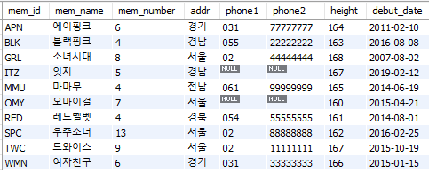

#### ② 스토어드 프로시저 삭제

```SQL
DROP PROCEDURE user_proc;
```


### 2. 스토어드 프로시저 실습

#### ① 매개변수의 사용

- 입력 매개변수 지정

```SQL
IN 입력_매개변수_이름 데이터_형식
```

```SQL
CALL 프로시저_이름(전달_값);
```

- 출력 매개변수 지정

```SQL
OUT 출력_매개변수_이름 데이터_형식
```

```SQL
CALL 프로시저_이름(@변수명)
SELECT @변수명
```


#### ② 입력 매개변수의 활용

- 입력이 1개일 때

```SQL
USE market_db;
DROP PROCEDURE IF EXISTS user_proc1;
DELIMITER $$
CREATE PROCEDURE user_proc1(IN userName VARCHAR(10))
BEGIN
	SELECT * FROM member WHERE mem_name = userName;
END $$
DELIMITER ;

CALL user_proc1('에이핑크')
```

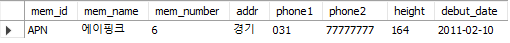

- 2개의 입력 매개변수

```SQL
DROP PROCEDURE IF EXISTS user_proc2;
DELIMITER $$
CREATE PROCEDURE user_proc2(
    IN userNumber INT,
	IN userHeight INT )
BEGIN
	SELECT * FROM member
    WHERE mem_number > userNumber AND height > userHeight;
END $$
DELIMITER ;

CALL user_proc2(6,165);
```

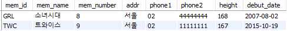

#### ③ 출력 매개변수의 활용

```SQL
DROP PROCEDURE IF EXISTS user_proc3;
DELIMITER $$
CREATE PROCEDURE user_proc3(
    IN txtValue CHAR(10),
	OUT outValue INT )
BEGIN
	INSERT INTO noTabe VALUES(NULL,txtValue);
	SELECT MAX(id) INTO outValue FROM noTable;
END $$
DELIMITER ;

CREATE TABLE IF NOT EXISTS noTable(
	id INT AUTO_INCREMENT PRIMARY KEY,
	txt CHAR(10)
);
```

- 스토어드 프로시저를 만드는 시점에 아직 존재하지 않는 테이블을 사용해도 프로시저 생성에는 문제가 없다.

```SQL
CALL user_proc3('테스트1', @myValue);
SELECT CONCAT('입력된 ID 값 ==>', @myValue);
```

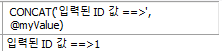

#### ④ SQL 프로그래밍의 활용

- IF ~ ELSE 문

```SQL
DROP PROCEDURE IF EXISTS ifelse_proc;
DELIMITER $$
CREATE PROCEDURE ifelse_proc(
    IN memName VARCHAR(10)
)
BEGIN
	DECLARE debutYear INT;
	SELECT YEAR(debut_date) INTO debutYear FROM member
		WHERE mem_name = memName;
	IF (debutYear >= 2015) THEN
		SELECT '신인 가수' AS '메시지';
	ELSE
		SELECT '고참 가수' AS '메시지';
	END IF;
END $$
DELIMITER ;

CALL ifelse_proc('오마이걸')
```

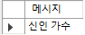

> ※ 날짜 함수
>
> YEAR(날짜), MONTH(날짜), DAY(날짜)는 각각 날짜에서 연,월,일을 구한다. CURDATE()는 현재 날짜를 확인.
>
> SELECT YEAR(CURDATE()), MONTH(CURDATE()), DAY(CURDATE())

- WHILE 문

```SQL
DROP PROCEDURE IF EXISTS while_proc;
DELIMITER $$
CREATE PROCEDURE while_proc()
BEGIN
	DECLARE hap INT;
	DECLARE num INT;
	SET hap = 0;
	SET num = 1;
	
	WHILE (num <= 100) DO
		SET hap = hap+num;
		SET num = num+1;
	END WHILE;
	SELECT hap AS '1~100 합계';
	
END $$
DELIMITER ;
CALL while_proc();
```

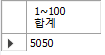

- 동적 SQL

```SQL
DROP PROCEDURE IF EXISTS dynamic_proc;
DELIMITER $$
CREATE PROCEDURE dynamic_proc(
	IN tableName VARCHAR(20)
)
BEGIN
	SET @sqlQuery = CONCAT('SELECT * FROM ', tableName); -- 문자열 생성
	PREPARE myQuery, FROM @sqlQuery; 
	EXECUTE myQuery; -- 문자열 실행
	DEALLOCATE PREPARE myQuery; -- myQuery 해제
	
END $$
DELIMITER ;

CALL dynamic_proc('member');
```


## 스토어드 프로시저 함수와 커서

### 1. 스토어드 함수

#### ① 스토어드 함수의 개념과 형식

> SUM(), CAST(), CONCAT(), CURRENT_DATE() 등을 사용해봤다. MySQL이 사용자가 원하는 모든 함수를 제공하지는 않기 때문에 원하는 함수를 만들어서 사용가능하다. 직접 만들어서 사용하는 함수를 **스토어드 함수**라고 한다.

- 형식

```SQL
DELIMITER $$
CREATE FUNCTION 스토어드_함수_이름(매개변수)
	RETURNS 반환형식
BEGIN
	프로그래밍 코딩
	RETURN 반환값;
END $$
DELIMITER ;
SELECT 스토어드_함수_이름();
```

- 스토어드 프로시저와의 차이점
  - 스토어드 함수는 `RETURNS` 문으로 반환할 값의 데이터 형식 지정, 본문 안에서는 `RETURN` 문으로 하나의 값으로 반환.
  - 스토어드 함수의 매개변수는 모두 입력 매개변수다. 그리고 `IN`을 붙이지 않는다.
  - 스토어드 프로시저는 `CALL`로 호출, 스토어드 함수는 `SELECT`문으로 호출
  - 스토어드 프로시저 안에서는 `SELECT`문 사용가능, 스토어드 함수 안에서는 `SELECT` 사용할 수 없다.

#### ② 스토어드 함수의 사용

> 스토어드 함수를 사용하기 위해서는 SQL로 스토어드 함수 생성 권한을 허용해줘야 한다.

```SQL
SET GLOBAL log_bin_trust_function_creators = 1;
```

- 간단한 스토어 함수

```SQL
USE market_db;
DROP FUNCTION IF EXISTS sumFunc;
DELIMITER $$
CREATE FUNCTION sumFunc(number1 INT, number2 INT)
	RETURNS INT
BEGIN
	RETURN number1 + number2;
END $$
DELIMITER ;

SELECT sumFunc(100,200) AS '합계'
```

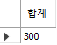

```SQL
USE market_db;
DROP FUNCTION IF EXISTS calcYearFunc;
DELIMITER $$
CREATE FUNCTION calcYearFunc(dYear INT)
	RETURNS INT
BEGIN
	DECLARE runYear INT;
	SET runYear = YEAR(CURDATE()) -dYear;
	RETURN runYear;
END $$
DELIMITER ;

SELECT calcYearFunc(2010) AS '활동 햇수'
```
```SQL
SELECT calcYearFunc(2007) INTO @debut2007;
SELECT calcYearFunc(2013) INTO @debut2013;
SELECT @debut2007 - @debut2013 AS '2007과 2013 차이';
```
```SQL
SELECT mem_id, mem_name, calcYearFunc(YEAR(debut_date)) AS '활동 햇수'
	FROM member;
```
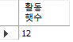  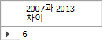  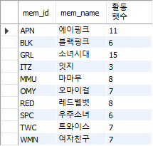

- 기존에 작성된 스토어드 함수의 내용을 확인

```SQL
SHOW CREATE FUNCTION 함수_이름
```

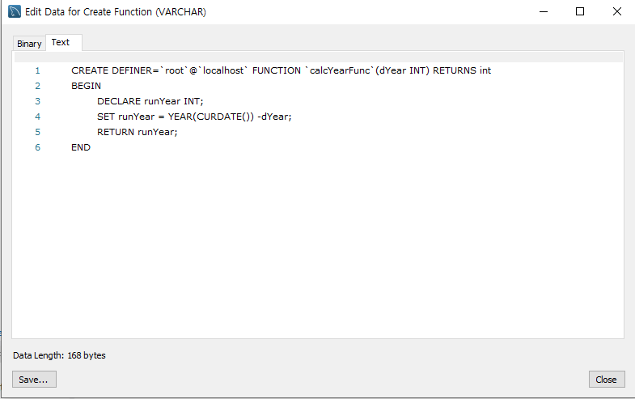

- 함수의 삭제

```SQL
DROP FUNCTION calcYearFunc;
```


### 2. 커서로 한 행씩 처리하기

#### ① 커서의 기본 개념

> 커서는 첫 번째 행을 처리한 후에 마지막 행까지 한 행씩 접근해서 값을 처리.

#### ② 단계별 실습

1. 사용할 변수 준비하기

```SQL
DECLARE memNumber INT; 					-- 각 회원의 인원수
DECLARE cnt INT DEFAULT 0; 				-- 읽은 행의 수
DECLARE totNumber INT DEFAULT 0; 		-- 전체 인원의 합계
DECLARE endOfRow BOOLEAN DEFAULT FALSE; -- 행의 끝을 파악하는 변수
```

2. 커서 선언하기

```SQL
DECLARE memberCursor CURSOR FOR
	SELECT mem_number FROM member;
```

3. 반복 조건 선언하기

```SQL
DECLARE CONTINUE HANDLER
	FOR NOT FOUND SET endOfRow = TRUE;
```

4. 커서 열기

```SQL
OPEN memberCuror;
```

5. 행 반복하기

```SQL
IF endOfRow THEN
	LEAVE cursor_loop;
END IF;
```

```SQL
cursor_loop:LOOP
	FETCH memberCuror INTO memNumber;
	
	IF endOfRow THEN
		LEAVE cursor_loop;
	END IF;
	
	SET cnt = cnt+1;
	SET totNumber = totNumber + memNumber;
END LOOP cursor_loop;

SELECT (totNumber/cnt) AS '회원의 평균 인원 수';
```

6. 커서 닫기

```SQL
CLOSE memberCuror
```


#### ③ 통합 코드

```SQL
USE market_db;
DROP FUNCTION IF EXISTS cursor_proc;
DELIMITER $$
CREATE PROCEDURE cursor_proc()
BEGIN
	DECLARE memNumber INT; 					-- 각 회원의 인원수
	DECLARE cnt INT DEFAULT 0; 				-- 읽은 행의 수
	DECLARE totNumber INT DEFAULT 0; 		-- 전체 인원의 합계
	DECLARE endOfRow BOOLEAN DEFAULT FALSE; -- 행의 끝을 파악하는 변수

	DECLARE memberCuror CURSOR FOR
		SELECT mem_number FROM member;
		
	DECLARE CONTINUE HANDLER
		FOR NOT FOUND SET endOfRow = TRUE;

	OPEN memberCuror;
    
    cursor_loop:LOOP
		FETCH memberCuror INTO memNumber;
		
		IF endOfRow THEN
			LEAVE cursor_loop;
		END IF;
		
		SET cnt = cnt+1;
		SET totNumber = totNumber + memNumber;
	END LOOP cursor_loop;

	SELECT (totNumber/cnt) AS '회원의 평균 인원 수';

	CLOSE memberCuror;
END $$
DELIMITER ;

CALL cursor_proc();
```

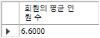


