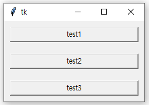

# SQL과 파이썬 연결

## 파이썬 개발 환경 준비

> Python에는 MySQL을 인식하는 기능이 없으므로 PyMySQL이라는 외부 라이브러리 설치 필요

### 1. Python 설치

> www.python.org 에서 Python 설치 후 CMD 창에서 `pip install pymysql` 입력


## 파이썬과 MySQL의 연동

### 1. 연동 프로그래밍 기본

#### ① 임의의 DB 생성

- MySQL 워크벤치를 실행 DB를 생성

```SQL
DROP DATABASE IF EXISTS soloDB;
CREATE DATABASE soloDB;
```

#### ② 파이썬에서의 데이터 입력

1. 데이터 베이스 연동.

```python
import pymysql
conn = pymysql.connect(host = '서버IP주소', user = '사용자', password = '암호', db = '데이터베이스', charset = '문자세트')
# 문자세트를 utf8 사용해 한글 사용에 문제가 없도록 한다.
```

2. 커서 생성
   - 커서는 데이터베이스에 SQL 문을 실행하거나 실행된 결과를 돌려받는 통로라고 생각한다.

```python
cur = conn.cursor()
```

3. 테이블 생성
   - 테이블을 만드는 SQL 문을 커서이름.execute() 함수의 매개변수로 넘겨주면 SQL 문이 데이터베이스에 실행된다.

```python
cur.execute("CREATE TABLE userTable (id CHAR(4), userName char(15), email char(20), birthYear int)")
```

4. 데이터 입력

```python
cur.execute("INSERT INTO userTable VALUES('hong', '홍지윤', 'hong@naver.com',1996)")
cur.execute("INSERT INTO userTable VALUES('kim', '김태연', 'kin@daum.net',2011)")
cur.execute("INSERT INTO userTable VALUES('star', '별사랑', 'star@paran.com',1990)")
cur.execute("INSERT INTO userTable VALUES('yang', '양지은', 'yang@gmail.com',1993)")
```


5. 입력된 데이터 저장 및 데이터 베이스 닫기

```python
conn.commit()
conn.close()
```

### 2. 연동 프로그래밍 활용

#### ① 완전한 데이터 입력 프로그램의 완성

```python
import pymysql

# 전역변수 선언
conn, cur = None, None
data1, data2, data3, data4 = "","","",""

# 메인 코드
# 커서 준비
conn = pymysql.connect(host = '127.0.0.1', user ='root', password = '----', db = 'soloDB', charset = 'utf8')
cur = conn.cursor()

# 반복 데이터 입력
# 아무 입력 없이 `Enter`입력 시 반복 종료
while (True):
    data1 = input("사용자 ID ==> ")
    if data1 == "":
        break;
    data2 = input("사용자 이름 ==> ")
    data3 = input("사용자 이메일 ==> ")
    data4 = input("사용자 출생연도 ==> ")
    sql = "INSERT INTO userTable VALUES('" + data1 + "','" + data2 + "','" + data3 + "'," + data4 + ")"
    cur.execute(sql)
    
# 데이터 저장 및 데이터베이스 닫기
conn.commit()
conn.close()
```


#### ② 완전한 데이터 조회 프로그램의 완성

```python
import pymysql

# 전역변수 선언부
con, cur = None, None
data1, data2, data3, data4 = "", "", "", ""
row=None

# 메인 코드
conn = pymysql.connect(host = '127.0.0.1', user ='root', password = '----', db = 'soloDB', charset = 'utf8')
cur = conn.cursor()

cur.execute("SELECT * FROM userTable")

print("사용자ID    사용자이름    이메일        출생연도")
print("----------------------------------------------------")

while (True) :
    row = cur.fetchone()
    # fetchone() 함수로 결과를 한 행씩 추출
    # 조회된 결과가 조회되는 row 변수에는 튜플 형식으로 각 행 데이터 저장
    if row== None :
        break
    data1 = row[0]
    data2 = row[1]
    data3 = row[2]
    data4 = row[3]
    print("%5s   %15s   %20s   %d" % (data1, data2, data3, data4))

conn.close()
```


## GUI 응용 프로그램

### 1. GUI 기본 프로그래밍

> 윈도 생성 라이브러리인 `tkinter` 사용

#### ① 기본 윈도의 구성

```python
from tkinter import *

root = Tk()
# Tk()는 기본이 되는 윈도를 반환, root 변수에 넣는다.
# Tk()를 root window라고도 부른다.
root.mainloop()
```
- 윈도 제목 및 크기 조절
```python
from tkinter import *

root = Tk()
root.title("Test File")
root.geometry("400x200")

root.mainloop()
```

  

#### ② 라벨

- `fg`는 글자색, `bg`는 배경색을 지정한다.

- `pack()`함수를 이용해야 화면에 출력

```python
from tkinter import *

root = Tk()
root.geometry("300x100")

label1 = Label(root, text = "SQL 학습")
label2 = Label(root, text = "test 연습", font = ("궁서체",30), bg = "blue", fg ="yellow")

label1.pack()
label2.pack()

root.mainloop()
```


#### ③ 버튼

- 마우스 클릭시 지정한 작업이 실행되도록 사용되는 위젯
- `pack()`에서 버튼을 화면 중앙에 표현하기 위해 `expand = 1` 옵션을 추가

```python
from tkinter import *
from tkinter import messagebox

def clickbox():
    messagebox.showinfo('버튼 클릭', '버튼을 눌렀습니다..')
    
root = Tk()
root.geometry("200x200")

button1 = Button(root, text = "클 릭", bg = "yellow", fg ="red")

button1.pack(expand = 1)

root.mainloop()
```

  

#### ④ 위젯의 정렬

- `pack()` 함수에서 가로 정렬을 하기 위해 `side = LEFT` 혹은 `side = RIGHT` 으로 설정 가능.
  - `side = TOP`, `side= BOTTOM`을 이용해 수직 정렬 가능

```python
from tkinter import *

root = Tk()

button1 = Button(root, text = 'test1')
button2 = Button(root, text = 'test2')
button3 = Button(root, text = 'test3')

button1.pack(side = LEFT)
button2.pack(side = LEFT)
button3.pack(side = LEFT)

root.mainloop()
```


#### ⑤ 위젯 사이의 여백 추가

- `padx`,`pady`는 각각 위젯에 대한 x 방향, y방향 외부 패딩을 의미

```python
from tkinter import *

root = Tk()

button1 = Button(root, text = 'test1')
button2 = Button(root, text = 'test2')
button3 = Button(root, text = 'test3')

button1.pack(side = TOP, fill = X, padx = 10, pady = 10)
button2.pack(side = TOP, fill = X, padx = 10, pady = 10)
button3.pack(side = TOP, fill = X, padx = 10, pady = 10)

root.mainloop()
```



#### ⑥ 프레임, 엔트리, 리스트 박스

- 프레임은 화면을 여러 구역으로 나눌 때 사용하며, 엔트리는 입력 상자를 표현. 리스트 박스는 목록을 표현한다.
- 리스트 박스에 데이터를 입력할 때, END는 데이터를 제일 뒤에 첨부하라는 의미.

```python
from tkinker import *
root = Tk()
root.geometry("200x250")

upFrame = Frame(root)
upFrame.pack()
downFrame = Frame(root)
downFrame.pack()

editBox = Entry(upFrame, width = 10)
editBox.pack(padx = 20, pady = 20)

listbox = Listbox(downFrame, bg = 'yellow')
listbox.pack()

listbox.insert(END,"하나")
listbox.insert(END,"둘")
listbox.insert(END,"셋")

root.mainloop()
```


### 2. 완전한 형태의 GUI 응용 프로그래밍

```python
import pymysql
from tkinter import *
from tkinter import messagebox

## 메인 코드부
def insertData() :
    con, cur = None, None
    data1, data2, data3, data4 = "", "", "", ""
    sql=""

    conn = pymysql.connect(host='127.0.0.1', user='root', password='0627', db='soloDB', charset='utf8')
    cur = conn.cursor()

    data1 = edt1.get();    data2 = edt2.get();    data3 = edt3.get();    data4 = edt4.get()
    sql = "INSERT INTO userTable VALUES('" + data1 + "','" + data2 + "','" + data3 + "'," + data4 + ")"
    cur.execute(sql)

    conn.commit()
    conn.close()

    messagebox.showinfo('성공', '데이터 입력 성공')


def selectData() :
    strData1, strData2, strData3, strData4  = [], [], [], []

    conn = pymysql.connect(host='127.0.0.1', user='root', password='0000', db='soloDB', charset='utf8')
    cur = conn.cursor()
    cur.execute("SELECT * FROM userTable")
    
    strData1.append("사용자 ID");      strData2.append("사용자 이름")
    strData3.append("사용자 이메일");   strData4.append("사용자 출생연도")
    strData1.append("-----------");    strData2.append("-----------")
    strData3.append("-----------");    strData4.append("-----------")
    
    while (True) :
        row = cur.fetchone()
        if row== None :
            break;
        strData1.append(row[0]);        strData2.append(row[1])
        strData3.append(row[2]);        strData4.append(row[3])

    listData1.delete(0,listData1.size() - 1);    listData2.delete(0,listData2.size() - 1)
    listData3.delete(0,listData3.size() - 1);    listData4.delete(0,listData4.size() - 1)
    
    for item1, item2, item3, item4 in zip(strData1, strData2, strData3, strData4 ):
        listData1.insert(END, item1);        listData2.insert(END, item2)
        listData3.insert(END, item3);        listData4.insert(END, item4)
        
    conn.close()    


## 메인 코드부
root = Tk()
root.geometry("600x300")
root.title("완전한 GUI 응용 프로그램")

edtFrame = Frame(root);
edtFrame.pack()
listFrame = Frame(root)
listFrame.pack(side = BOTTOM,fill=BOTH, expand=1)

edt1= Entry(edtFrame, width=10);    edt1.pack(side=LEFT,padx=10,pady=10)
edt2= Entry(edtFrame, width=10);    edt2.pack(side=LEFT,padx=10,pady=10)
edt3= Entry(edtFrame, width=10);    edt3.pack(side=LEFT,padx=10,pady=10)
edt4= Entry(edtFrame, width=10);    edt4.pack(side=LEFT,padx=10,pady=10)

btnInsert = Button(edtFrame, text="입력", command = insertData)
btnInsert.pack(side=LEFT,padx=10,pady=10)
btnSelect = Button(edtFrame, text="조회", command =selectData )
btnSelect.pack(side=LEFT,padx=10,pady=10)

listData1 = Listbox(listFrame,bg = 'yellow');
listData1.pack(side=LEFT,fill=BOTH, expand=1)
listData2 = Listbox(listFrame,bg = 'yellow')
listData2.pack(side=LEFT,fill=BOTH, expand=1)
listData3 = Listbox(listFrame,bg = 'yellow')
listData3.pack(side=LEFT,fill=BOTH, expand=1)
listData4 = Listbox(listFrame,bg = 'yellow')
listData4.pack(side=LEFT,fill=BOTH, expand=1)

root.mainloop()
```


