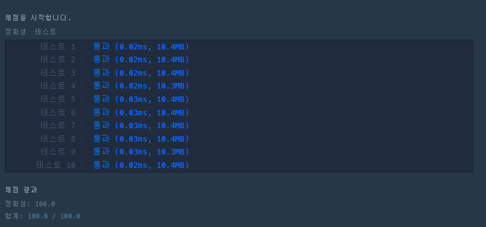

# 숫자 문자열과 영단어

>네오와 프로도가 숫자놀이를 하고 있습니다. 네오가 프로도에게 숫자를 건넬 때 일부 자릿수를 영단어로 바꾼 카드를 건네주면 프로도는 원래 숫자를 찾는 게임입니다.
>
>다음은 숫자의 일부 자릿수를 영단어로 바꾸는 예시입니다.
>
>- 1478 → "one4seveneight"
>- 234567 → "23four5six7"
>- 10203 → "1zerotwozero3"
>
이렇게 숫자의 일부 자릿수가 영단어로 바뀌어졌거나, 혹은 바뀌지 않고 그대로인 문자열 `s`가 매개변수로 주어집니다. `s`가 의미하는 원래 숫자를 return 하도록 solution 함수를 완성해주세요.
>
참고로 각 숫자에 대응되는 영단어는 다음 표와 같습니다.

| 숫자 | 영단어 |
| ---- | ------ |
| 0    | zero   |
| 1    | one    |
| 2    | two    |
| 3    | three  |
| 4    | four   |
| 5    | five   |
| 6    | six    |
| 7    | seven  |
| 8    | eight  |
| 9    | nine   |

##### 제한사항

- 1 ≤ `s`의 길이 ≤ 50
- `s`가 "zero" 또는 "0"으로 시작하는 경우는 주어지지 않습니다.
- return 값이 1 이상 2,000,000,000 이하의 정수가 되는 올바른 입력만 `s`로 주어집니다.

------

##### 입출력 예

| s                    | result |
| -------------------- | ------ |
| `"one4seveneight"`   | 1478   |
| `"23four5six7"`      | 234567 |
| `"2three45sixseven"` | 234567 |
| `"123"`              | 123    |

------

##### 입출력 예 설명

**입출력 예 #1**

- 문제 예시와 같습니다.

**입출력 예 #2**

- 문제 예시와 같습니다.

**입출력 예 #3**

- "three"는 3, "six"는 6, "seven"은 7에 대응되기 때문에 정답은 입출력 예 #2와 같은 234567이 됩니다.
- 입출력 예 #2와 #3과 같이 같은 정답을 가리키는 문자열이 여러 가지가 나올 수 있습니다.

**입출력 예 #4**

- `s`에는 영단어로 바뀐 부분이 없습니다.

------

##### 제한시간 안내

- 정확성 테스트 : 10초


### 나의 풀이

대응되는 영단어들을 딕셔너리 구조로 만들어 문자열 `s`에서 숫자일 경우 그대로 `answer`에 더해주고 영단어일 경우 변수 `eng`에 더한다. `eng`가 zero와 같이 딕셔너리의 키값에 해당하는 단어가 될 경우 `answer`에 해당 키 값에 해당하는 `value`를 문자형태로 이어붙여준다. `return`으로 변환된 `answer`를 int를 이용해 정수형태로 출력한다.

```python
def solution(s):
    
    answer = ''
    eng = ''
    dict = {'zero' :0 ,'one' :1, 'two' :2, 'three' :3, 'four' :4, 'five' :5, 'six' :6, 'seven' :7, 'eight' :8, 'nine' :9 }

    for i in s:
        if i.isdigit():
            answer += i
        elif i.isalpha():
            eng += i
            
            if eng in dict.keys():
                answer += str(dict[eng])
                eng = ''

    return int(answer)
```

> python

```c
#include <stdio.h>
#include <stdbool.h>
#include <stdlib.h>
#include <string.h>

// 파라미터로 주어지는 문자열은 const로 주어집니다. 변경하려면 문자열을 복사해서 사용하세요.
int solution(const char* s) {
    int answer = 0;
    char ans[50] = "";
    char e_nums[10][6] = {"zero", "one", "two", "three", "four", "five", "six", "seven", "eight", "nine"};
    int s_index = 0;
    int ans_index = 0;
    
    while (s_index < strlen(s))
    {
        if ((s[s_index] >= 48) && (s[s_index] <= 57)) {
            ans[ans_index++] = s[s_index];
            s_index++;
        }
        
        else {
            for (int i = 0; i < 10; i++) {
                if (strncmp( s + s_index , e_nums[i], 3) == 0) {
                    char e_num_to_ans = i +'0';
                    ans[ans_index++] = e_num_to_ans;
                    s_index += strlen(e_nums[i]);
                }
            }
        }
    }
    answer = atoi(ans);
    
    return answer;
}
```

> C

### 실행결과




### 다른 사람 풀이

```python
num_dic = {"zero":"0", "one":"1", "two":"2", "three":"3", "four":"4", "five":"5", "six":"6", "seven":"7", "eight":"8", "nine":"9"}

def solution(s):
    answer = s
    for key, value in num_dic.items():
        answer = answer.replace(key, value)
    return int(answer)
```

```python
def solution(s):
    words = ['zero', 'one', 'two', 'three', 'four', 'five', 'six', 'seven', 'eight', 'nine']

    for i in range(len(words)):
        s = s.replace(words[i], str(i))

    return int(s)
```

두 개의 풀이방법 모두 `replace`를 이용해 딕셔너리의 키값에 해당하는 문자를 원하는 숫자 값으로 변환해주는 방식을 이용하고 있다. 해당 코드들로 실행결과 실행속도, 용량면에서 큰 변화는 없지만 코드의 길이가 매우 줄어드니 **딕셔너리를 이용한 replace 방식 명심하기**.

