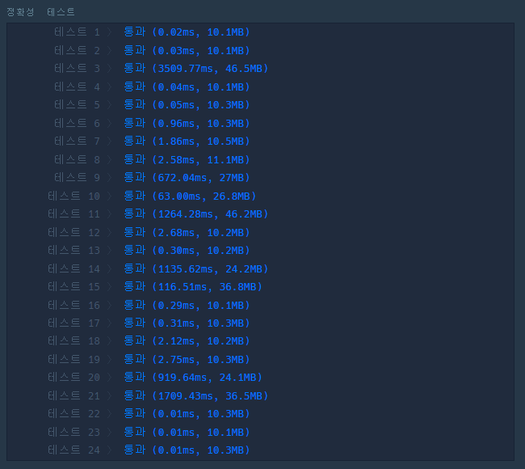

# 신고 결과 받기


## 문제 설명

신입사원 무지는 게시판 불량 이용자를 신고하고 처리 결과를 메일로 발송하는 시스템을 개발하려 합니다. 무지가 개발하려는 시스템은 다음과 같습니다.

- 각 유저는 한 번에 한 명의 유저를 신고할 수 있습니다.
  - 신고 횟수에 제한은 없습니다. 서로 다른 유저를 계속해서 신고할 수 있습니다.
  - 한 유저를 여러 번 신고할 수도 있지만, 동일한 유저에 대한 신고 횟수는 1회로 처리됩니다.
- k번 이상 신고된 유저는 게시판 이용이 정지되며, 해당 유저를 신고한 모든 유저에게 정지 사실을 메일로 발송합니다.
  - 유저가 신고한 모든 내용을 취합하여 마지막에 한꺼번에 게시판 이용 정지를 시키면서 정지 메일을 발송합니다.

다음은 전체 유저 목록이 ["muzi", "frodo", "apeach", "neo"]이고, k = 2(즉, 2번 이상 신고당하면 이용 정지)인 경우의 예시입니다.

| 유저 ID  | 유저가 신고한 ID | 설명                               |
| -------- | ---------------- | ---------------------------------- |
| "muzi"   | "frodo"          | "muzi"가 "frodo"를 신고했습니다.   |
| "apeach" | "frodo"          | "apeach"가 "frodo"를 신고했습니다. |
| "frodo"  | "neo"            | "frodo"가 "neo"를 신고했습니다.    |
| "muzi"   | "neo"            | "muzi"가 "neo"를 신고했습니다.     |
| "apeach" | "muzi"           | "apeach"가 "muzi"를 신고했습니다.  |

각 유저별로 신고당한 횟수는 다음과 같습니다.

| 유저 ID  | 신고당한 횟수 |
| -------- | ------------- |
| "muzi"   | 1             |
| "frodo"  | 2             |
| "apeach" | 0             |
| "neo"    | 2             |

위 예시에서는 2번 이상 신고당한 "frodo"와 "neo"의 게시판 이용이 정지됩니다. 이때, 각 유저별로 신고한 아이디와 정지된 아이디를 정리하면 다음과 같습니다.

| 유저 ID  | 유저가 신고한 ID  | 정지된 ID        |
| -------- | ----------------- | ---------------- |
| "muzi"   | ["frodo", "neo"]  | ["frodo", "neo"] |
| "frodo"  | ["neo"]           | ["neo"]          |
| "apeach" | ["muzi", "frodo"] | ["frodo"]        |
| "neo"    | 없음              | 없음             |

따라서 "muzi"는 처리 결과 메일을 2회, "frodo"와 "apeach"는 각각 처리 결과 메일을 1회 받게 됩니다.

이용자의 ID가 담긴 문자열 배열 `id_list`, 각 이용자가 신고한 이용자의 ID 정보가 담긴 문자열 배열 `report`, 정지 기준이 되는 신고 횟수 `k`가 매개변수로 주어질 때, 각 유저별로 처리 결과 메일을 받은 횟수를 배열에 담아 return 하도록 solution 함수를 완성해주세요.

------

### 제한사항

- 2 ≤`id_list`의 길이 ≤ 1,000

    - 1 ≤ `id_list`의 원소 길이 ≤ 10
    - `id_list`의 원소는 이용자의 id를 나타내는 문자열이며 알파벳 소문자로만 이루어져 있습니다.
    - `id_list`에는 같은 아이디가 중복해서 들어있지 않습니다.

- 1 ≤`report`의 길이 ≤ 200,000

    - 3 ≤ `report`의 원소 길이 ≤ 21
    - `report`의 원소는 "이용자id 신고한id"형태의 문자열입니다.
    - 예를 들어 "muzi frodo"의 경우 "muzi"가 "frodo"를 신고했다는 의미입니다.
    - id는 알파벳 소문자로만 이루어져 있습니다.
    - 이용자id와 신고한id는 공백(스페이스)하나로 구분되어 있습니다.
    - 자기 자신을 신고하는 경우는 없습니다.

- 1 ≤ `k` ≤ 200, `k`는 자연수입니다.

- return 하는 배열은 `id_list`에 담긴 id 순서대로 각 유저가 받은 결과 메일 수를 담으면 됩니다.

------

##### 입출력 예

| id_list                              | report                                                       | k    | result    |
| ------------------------------------ | ------------------------------------------------------------ | ---- | --------- |
| `["muzi", "frodo", "apeach", "neo"]` | `["muzi frodo","apeach frodo","frodo neo","muzi neo","apeach muzi"]` | 2    | [2,1,1,0] |
| `["con", "ryan"]`                    | `["ryan con", "ryan con", "ryan con", "ryan con"]`           | 3    | [0,0]     |

------

##### 입출력 예 설명

**입출력 예 #1**

문제의 예시와 같습니다.

**입출력 예 #2**

"ryan"이 "con"을 4번 신고했으나, 주어진 조건에 따라 한 유저가 같은 유저를 여러 번 신고한 경우는 신고 횟수 1회로 처리합니다. 따라서 "con"은 1회 신고당했습니다. 3번 이상 신고당한 이용자는 없으며, "con"과 "ryan"은 결과 메일을 받지 않습니다. 따라서 [0, 0]을 return 합니다.

------

##### 제한시간 안내

- 정확성 테스트 : 10초


## 문제 풀이

이 문제에서 고려해야 하는 것은 같은 신고자가 같은 사람을 여러번 신고해도 1번 신고한 것으로 처리된다는 점, k번 이상 신고를 받으면 해당 유저를 신고한 신고자에게 정지 사실을 메일로 발송한다는 점이다.

1. 처음 여러번 같은 사람을 신고해도 1번 신고하는 것을 고려해주기 위해서 `set` 자료형을 이용한다. `report`를 `set ` 자료형을 이용해 중복된 값들을 제거한다.
2. `defaultdict`을 이용해서 2개의 딕셔너리 구조를 만든다.
   - 신고자가 신고를 한 유저 목록
   - 신고당한 횟수
3. `split`함수를 이용해 `report`의 각 원소마다 신고자와 신고당한 유저의 ID를 추출한다. 두 ID를 이용해 2에서 만들었던 딕셔너리에 각각 신고당한 횟수, 신고자가 신고한 유저 목록에 추가한다.
   - 이때 신고 횟수가 k와 같다면 해당 ID를 정지 계정(`stop_account`) 리스트에 추가한다.

4. `stop_account`에서 정지된 ID가 신고한 유저 목록에 있다면 해당 계정으로 메일을 발송하기 위해 `answer`에 신고자 인덱스 번호로 1을 더해준다.
5. 최종 `answer`을 리턴하면 각 유저가 받을 메일을 확인할 수 있다.

```python
from collections import defaultdict

def solution(id_list, report, k):
    
    answer = [0] * len(id_list)
    # 1. 중복 제거
    report = set(report)
	
    # 2. dict 구조 생성
    reporter = defaultdict(list)
    cnt_report = defaultdict(int)
    stop_account = []
    
    for i in report:
    # 3. 신고자, 신고당한 유저 나눠 dict에 추가
        report_person, stop_person = i.split()

        cnt_report[stop_person] += 1
        reporter[report_person].append(stop_person)

        if cnt_report[stop_person] == k:
            stop_account.append(stop_person)
	# 4. 정지된 유저를 신고한 유저 확인 후 메일 추가
    for j in stop_account:
        for k in range(len(id_list)):
            if j in reporter[id_list[k]]:
                answer[k] += 1

    return answer
```




### 다른 풀이

```python
def solution(id_list, report, k):
    answer = [0] * len(id_list)    
    reports = {x : 0 for x in id_list}

    for r in set(report):
        reports[r.split()[1]] += 1

    for r in set(report):
        if reports[r.split()[1]] >= k:
            answer[id_list.index(r.split()[0])] += 1

    return answer
```

> 신고 유저와 신고 당한 유저를 따로 변수에 저장하는 것이 아니라 report의 각 원소마다 인덱스 번호를 이용해 사용.
>
> 신고당한 횟수를 reports에 저장하고 k보다 크다면 해당 유저의 인덱스 번호에 해당하는 answer 값을 1씩 증가시켜 나의 풀이와 같은 결과를 도출해낸다.
>
> - 1개의 dict 만으로 문제 해결이 가능한 방법
> - 새로운 변수를 생성하지 않아도 충분히 문제 해결이 가능하다는 것을 확인