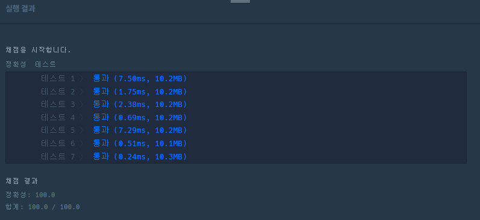

# 약수의 개수와 덧셈

> 두 정수 `left`와 `right`가 매개변수로 주어집니다. `left`부터 `right`까지의 모든 수들 중에서, 약수의 개수가 짝수인 수는 더하고, 약수의 개수가 홀수인 수는 뺀 수를 return 하도록 solution 함수를 완성해주세요.


## 제한사항

- 1 ≤ `left` ≤ `right` ≤ 1,000


### 입출력 예 설명

**입출력 예 #1**

- 다음 표는 13부터 17까지의 수들의 약수를 모두 나타낸 것입니다.

| 수   | 약수           | 약수의 개수 |
| ---- | -------------- | ----------- |
| 13   | 1, 13          | 2           |
| 14   | 1, 2, 7, 14    | 4           |
| 15   | 1, 3, 5, 15    | 4           |
| 16   | 1, 2, 4, 8, 16 | 5           |
| 17   | 1, 17          | 2           |

- 따라서, 13 + 14 + 15 - 16 + 17 = 43을 return 해야 합니다.

**입출력 예 #2**

- 다음 표는 24부터 27까지의 수들의 약수를 모두 나타낸 것입니다.

| 수   | 약수                     | 약수의 개수 |
| ---- | ------------------------ | ----------- |
| 24   | 1, 2, 3, 4, 6, 8, 12, 24 | 8           |
| 25   | 1, 5, 25                 | 3           |
| 26   | 1, 2, 13, 26             | 4           |
| 27   | 1, 3, 9, 27              | 4           |

- 따라서, 24 - 25 + 26 + 27 = 52를 return 해야 합니다.


### 나의 풀이

자연수는 제곱수를 제외하고는 모두 짝수 개의 약수를 갖는다. 따라서 `left`부터 `right` 까지 1씩 증가시키면서 제곱수일 아닐 경우에는 `answer`에 값을 더해주고 아닐경우 `answer`에서 빼는 과정을 반복한다. 

```python
def solution(left, right):
    answer = 0
    for num in range(left,right+1):
        for i in range(1,num+1):
            
            if i**2 > num:
                answer += num
                break
                
            elif i**2 == num:
                answer -= num
                break
        
    return answer
```


### 실행 결과




### 다른 사람 풀이

```python
def solution(left, right):
    answer = 0
    for i in range(left,right+1):
        if int(i**0.5)==i**0.5:
            answer -= i
        else:
            answer += i
    return answer
```

> 나와는 다르게 `left`, `right` 사이의 값들을 루트를 씌워 정수값일 경우 `제곱수` 라는 의미이기 때문에 `answer`에서 값을 빼고 아닐 경우 더해주는 형태로 구현한 모습이다.