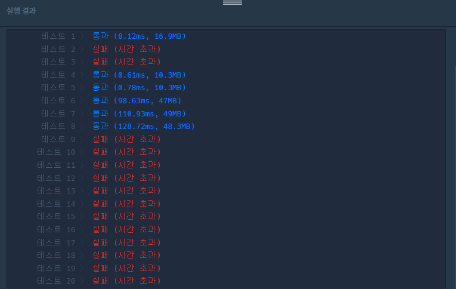
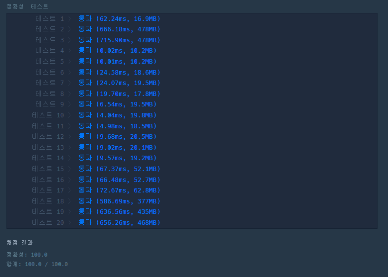

# n^2 배열 자르기

## 문제 설명

정수 `n`, `left`, `right`가 주어집니다. 다음 과정을 거쳐서 1차원 배열을 만들고자 합니다.

1. `n`행 `n`열 크기의 비어있는 2차원 배열을 만듭니다.

2. ```
   i = 1, 2, 3, ..., n
   ```

   에 대해서, 다음 과정을 반복합니다.

   - 1행 1열부터 `i`행 `i`열까지의 영역 내의 모든 빈 칸을 숫자 `i`로 채웁니다.

3. 1행, 2행, ..., `n`행을 잘라내어 모두 이어붙인 새로운 1차원 배열을 만듭니다.

4. 새로운 1차원 배열을 `arr`이라 할 때, `arr[left]`, `arr[left+1]`, ..., `arr[right]`만 남기고 나머지는 지웁니다.

정수 `n`, `left`, `right`가 매개변수로 주어집니다. 주어진 과정대로 만들어진 1차원 배열을 return 하도록 solution 함수를 완성해주세요.

---

### 제한사항

- 1 ≤ `n` ≤ 107
- 0 ≤ `left` ≤ `right` < n2
- `right` - `left` < 105

---

#### 입출력 예

| n    | left | right | result              |
| ---- | ---- | ----- | ------------------- |
| 3    | 2    | 5     | `[3,2,2,3]`         |
| 4    | 7    | 14    | `[4,3,3,3,4,4,4,4]` |


## 문제 풀이

- 2차원 배열을 만들어서 이어붙인 행렬은 1부터 n까지 연속적인 숫자를 시작으로 [2,2,3,4,5,..n], [3,3,3,4,5,...n], [n,n,n,n,n,...n] 와 같은 리스트의 합과 같다. 따라서 처음에 문제를 해결하기 위해서 for문 2개를 이용해 전체 행렬을 만들고 `left`, `right` 슬라이싱을 통해 답을 도출했다.

```python
def solution(n, left, right):
    answer = []
    for i in range(n):
      for j in range(n):
        if i >= j:
          answer.append(i+1)
        else:
          answer.append(j+1)
    return answer[left:right+1]
```

- 아래 그림과 같이 시간 초과로 인해 해결하지 못한다.



- 이런 시간문제를 해결하기 위해서 전체 행렬을 만들고 슬라이싱하는 것이 아니라 슬라이싱할 시작부분 행렬을 만들도록 했다.

① 필요한 조건들을 확인한다.

- 우선 `arr`에 1부터 `n` 까지 연속적인 숫자 리스트를 생성한다. 
- 시작지점의 인덱스를 확인하기 위해 `left`, `right`를 `n`으로 나눈 몫과 나머지를 구한다.


② `arr`은 인덱스 위치에 따라 달라지므로 코드로 구현한다.

- ex) n = 3, left = 2, right = 5 일때,  `left_q = 0`, `left_remain = 2`

  `arr[:0]= [1] * (0)`으로 [1,2,3], 나머지는 2 이므로 인덱스 위치 3번부터 시작한다.

  right의 경우`arr[:1]= [2] * (1)` → [2,2,3], `right_remain = 2`이므로 [2,2,3] 까지이다.
  1차원 행렬 [1,2,3, 2,2,3 ,3,3,3]에서 2~5 까지의 숫자는 [3,2,2,3]으로 제대로 구현했다.

  

③ 각 조건에 맞춰 arr을 `answer`에 추가한다.

-  `left_remain > 0` 조건을 이용해 시작 부분의 인덱스 위치에 맞춰서 `arr` 슬라이싱 후 추가. `left_remain `을 0으로 변환 해 동작안하도록 한다.
  - 이때 `left_q = right_q`인 경우가 발생할 수 있으므로 조건을 추가하고, 한 `arr`안에서 시작과 끝이 다 있으므로 바로 리턴된다.
- `left_q`가 증가해서 `left_q = right_q`될 경우 `right_remain`을 이용해 끝부분을 슬라이싱 후 추가
- 나머지 경우 ②에서 구한 `arr`을 그대로 추가한다.


④ 리턴 할 때 sum을 이용해 리스트내의 리스트를 전부 합친다.

```python
def solution(n, left, right):
    answer = []
	# 1. 필요한 조건 확인
    arr = [i for i in range(1,n+1)]
    left_q, left_remain = left // n, left % n
    right_q, right_remain = right // n, right % n

    while left_q <= right_q :
        # 2.
        arr[:left_q]= [left_q + 1] * (left_q)
        arr_copy = arr.copy()
        
        # 3.
        if left_remain > 0:
            if left_q == right_q:
                answer.append(arr_copy[left_remain:right_remain+1])
            else:
                answer.append(arr_copy[left_remain:])
                left_remain = 0
        
        elif left_q == right_q:
            answer.append(arr_copy[:right_remain+1])

        else:
            answer.append(arr_copy)

        left_q += 1

    return sum(answer,[])
```



