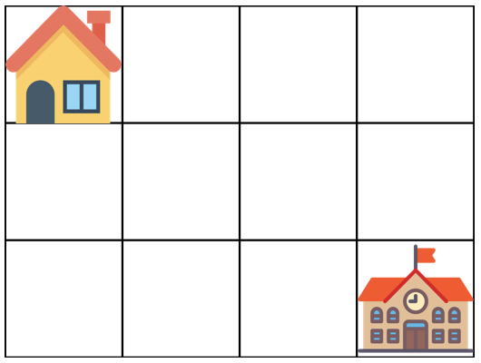

# 등굣길

## 문제 설명

계속되는 폭우로 일부 지역이 물에 잠겼습니다. 물에 잠기지 않은 지역을 통해 학교를 가려고 합니다. 집에서 학교까지 가는 길은 m x n 크기의 격자모양으로 나타낼 수 있습니다.

아래 그림은 m = 4, n = 3 인 경우입니다.



가장 왼쪽 위, 즉 집이 있는 곳의 좌표는 (1, 1)로 나타내고 가장 오른쪽 아래, 즉 학교가 있는 곳의 좌표는 (m, n)으로 나타냅니다.

격자의 크기 m, n과 물이 잠긴 지역의 좌표를 담은 2차원 배열 puddles이 매개변수로 주어집니다. **오른쪽과 아래쪽으로만 움직여** 집에서 학교까지 갈 수 있는 최단경로의 개수를 1,000,000,007로 나눈 나머지를 return 하도록 solution 함수를 작성해주세요.

### 제한사항

- 격자의 크기 m, n은 1 이상 100 이하인 자연수입니다.
  - m과 n이 모두 1인 경우는 입력으로 주어지지 않습니다.
- 물에 잠긴 지역은 0개 이상 10개 이하입니다.
- 집과 학교가 물에 잠긴 경우는 입력으로 주어지지 않습니다.

#### 입출력 예

| m    | n    | puddles  | return |
| ---- | ---- | -------- | ------ |
| 4    | 3    | [[2, 2]] | 4      |

##### 입출력 예 설명


## 문제 풀이


- A에서 B까지 최단 거리로 가는 방법은 위와 같이 각 좌표마다 최단 거리로 가는 방법들을 더하며 구할 수 있다.
- 주어진 문제에서는 `paddles`가 있기 때문에 `paddles`에 해당하는 좌표는 0으로 지정. 나머지 좌표는 이전 좌표들의 최단 거리 방법들을 더하면서 채워나간다.
  - 좌표는 행과 열 형태로 나타내기 위해 `n*m` 형태로 전부 변환 후 진행한다.

```python
def solution(m, n, puddles):
    answer = 0
    # n*m 형태로 표현하기 위해 좌표 변환
    puddles = [[b,a] for [a,b] in puddles]
    dp = [[0]*(m+1) for i in range(n+1)]
    
    # 시작 지점
    dp[1][1] = 1
    
    for i in range(1,n+1):
        for j in range(1, m+1):
            if i ==1 and j == 1:
                continue
            # paddles 좌표는 지나갈 수 없기 때문에 0 설정
            if [i,j] in puddles:
                dp[i][j] = 0
            else:
            # dp[i][j]좌표의 이전 방향의 경우의 수를 더한 후 1000000007로 나눈 나머지 값 저장
                dp[i][j] = (dp[i-1][j] + dp[i][j-1]) % 1000000007
    
    return dp[n][m]
```

