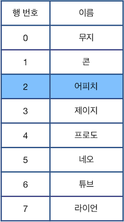
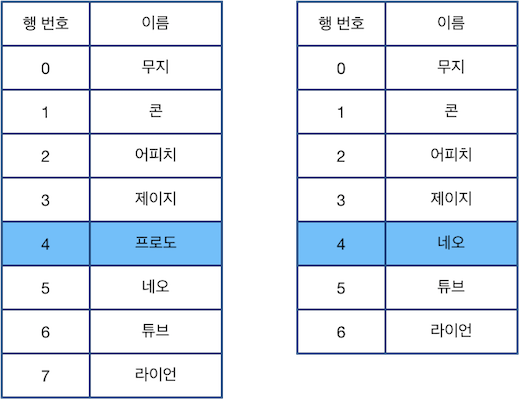
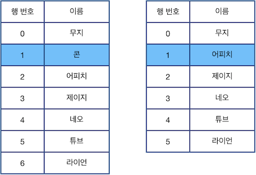
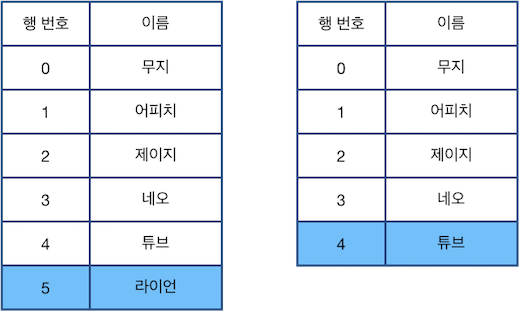
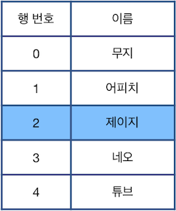
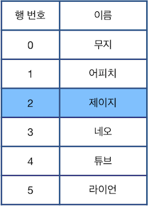
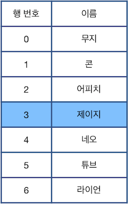
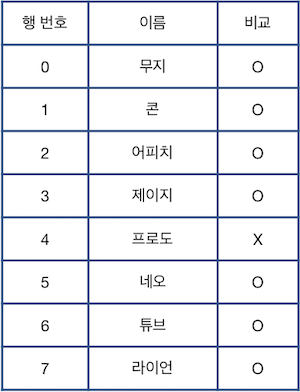
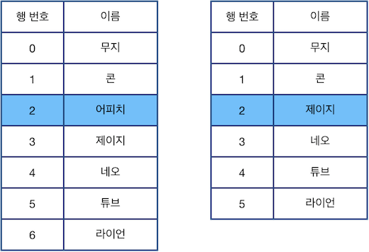
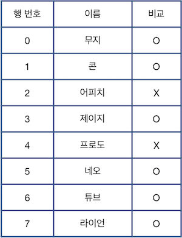

# 표 편집

## 문제 설명

**[본 문제는 정확성과 효율성 테스트 각각 점수가 있는 문제입니다.]**

업무용 소프트웨어를 개발하는 니니즈웍스의 인턴인 앙몬드는 명령어 기반으로 표의 행을 선택, 삭제, 복구하는 프로그램을 작성하는 과제를 맡았습니다. 세부 요구 사항은 다음과 같습니다



위 그림에서 파란색으로 칠해진 칸은 현재 **선택된 행**을 나타냅니다. 단, 한 번에 한 행만 선택할 수 있으며, 표의 범위(0행 ~ 마지막 행)를 벗어날 수 없습니다. 이때, 다음과 같은 명령어를 이용하여 표를 편집합니다.

- `"U X"`: 현재 선택된 행에서 X칸 위에 있는 행을 선택합니다.
- `"D X"`: 현재 선택된 행에서 X칸 아래에 있는 행을 선택합니다.
- `"C"` : 현재 선택된 행을 삭제한 후, 바로 아래 행을 선택합니다. 단, 삭제된 행이 가장 마지막 행인 경우 바로 윗 행을 선택합니다.
- `"Z"` : 가장 최근에 삭제된 행을 원래대로 복구합니다. **단, 현재 선택된 행은 바뀌지 않습니다.**

예를 들어 위 표에서 `"D 2"`를 수행할 경우 아래 그림의 왼쪽처럼 4행이 선택되며, `"C"`를 수행하면 선택된 행을 삭제하고, 바로 아래 행이었던 "네오"가 적힌 행을 선택합니다(4행이 삭제되면서 아래 있던 행들이 하나씩 밀려 올라오고, 수정된 표에서 다시 4행을 선택하는 것과 동일합니다).



다음으로 `"U 3"`을 수행한 다음 `"C"`를 수행한 후의 표 상태는 아래 그림과 같습니다.



다음으로 `"D 4"`를 수행한 다음 `"C"`를 수행한 후의 표 상태는 아래 그림과 같습니다. 5행이 표의 마지막 행 이므로, 이 경우 바로 윗 행을 선택하는 점에 주의합니다.



다음으로 `"U 2"`를 수행하면 현재 선택된 행은 2행이 됩니다.



위 상태에서 `"Z"`를 수행할 경우 가장 최근에 제거된 `"라이언"`이 적힌 행이 원래대로 복구됩니다.



다시한번 `"Z"`를 수행하면 그 다음으로 최근에 제거된 `"콘"`이 적힌 행이 원래대로 복구됩니다. 이때, 현재 선택된 행은 바뀌지 않는 점에 주의하세요.


이때, 최종 표의 상태와 처음 주어진 표의 상태를 비교하여 삭제되지 않은 행은 `"O"`, 삭제된 행은 `"X"`로 표시하면 다음과 같습니다.



처음 표의 행 개수를 나타내는 정수 n, 처음에 선택된 행의 위치를 나타내는 정수 k, 수행한 명령어들이 담긴 문자열 배열 cmd가 매개변수로 주어질 때, 모든 명령어를 수행한 후 표의 상태와 처음 주어진 표의 상태를 비교하여 삭제되지 않은 행은 O, 삭제된 행은 X로 표시하여 문자열 형태로 return 하도록 solution 함수를 완성해주세요.

------

### 제한사항

- 5 ≤ `n` ≤ 1,000,000

- 0 ≤ `k` < `n`

- 1 ≤ `cmd`의 원소 개수 ≤ 200,000

  - `cmd`의 각 원소는 `"U X"`, `"D X"`, `"C"`, `"Z"` 중 하나입니다.
  - X는 1 이상 300,000 이하인 자연수이며 0으로 시작하지 않습니다.
  - X가 나타내는 자연수에 ',' 는 주어지지 않습니다. 예를 들어 123,456의 경우 123456으로 주어집니다.
  - `cmd`에 등장하는 모든 X들의 값을 합친 결과가 1,000,000 이하인 경우만 입력으로 주어집니다.
  - 표의 모든 행을 제거하여, 행이 하나도 남지 않는 경우는 입력으로 주어지지 않습니다.
  - 본문에서 각 행이 제거되고 복구되는 과정을 보다 자연스럽게 보이기 위해 `"이름"` 열을 사용하였으나, `"이름"`열의 내용이 실제 문제를 푸는 과정에 필요하지는 않습니다. `"이름"`열에는 서로 다른 이름들이 중복없이 채워져 있다고 가정하고 문제를 해결해 주세요.

- 표의 범위를 벗어나는 이동은 입력으로 주어지지 않습니다.

- 원래대로 복구할 행이 없을 때(즉, 삭제된 행이 없을 때) "Z"가 명령어로 주어지는 경우는 없습니다.

- 정답은 표의 0행부터 n - 1행까지에 해당되는 O, X를 순서대로 이어붙인 문자열 형태로 return 해주세요.

#### 정확성 테스트 케이스 제한 사항

- 5 ≤ `n` ≤ 1,000
- 1 ≤ `cmd`의 원소 개수 ≤ 1,000

#### 효율성 테스트 케이스 제한 사항

- 주어진 조건 외 추가 제한사항 없습니다.

------

##### 입출력 예

| n    | k    | cmd                                                       | result       |
| ---- | ---- | --------------------------------------------------------- | ------------ |
| 8    | 2    | `["D 2","C","U 3","C","D 4","C","U 2","Z","Z"]`           | `"OOOOXOOO"` |
| 8    | 2    | `["D 2","C","U 3","C","D 4","C","U 2","Z","Z","U 1","C"]` | `"OOXOXOOO"` |

------

##### 입출력 예 설명

**입출력 예 #1**

문제의 예시와 같습니다.

**입출력 예 #2**

다음은 9번째 명령어까지 수행한 후의 표 상태이며, 이는 입출력 예 #1과 같습니다.


10번째 명령어 `"U 1"`을 수행하면 `"어피치"`가 적힌 2행이 선택되며, 마지막 명령어 `"C"`를 수행하면 선택된 행을 삭제하고, 바로 아래 행이었던 `"제이지"`가 적힌 행을 선택합니다.



따라서 처음 주어진 표의 상태와 최종 표의 상태를 비교하면 다음과 같습니다.




## 문제 풀이

`dict`를 이용한 연결리스트를 이용해 문제를 해결할 수 있다.

- `dict`의 `key`는 행을, `value`는 다음 이동할 노드들을 담는 형태로 구현한다.
- 이때 마지막 노드의 경우 다음 노드가 없기 때문에 마지막 노드는 `value`를 이전 노드와 0으로 구성한다.

`D`, `U` 명령어의 경우 `cmd`의 길이가 1보다 크기 때문에 조건문을 이용해 2가지 경우로 나눈다.

- `command`의 길이가 1보다 클 경우 c, x로 나눈다.
  - `c`가 'D'일 경우 `k = node[k][1]`에 의해 다음 노드로 이동한다. x의 값만큼 이동을 반복한다.
  - 마찬가지로 `c`가 'U'일 경우  `k = node[k][0]`에 의해 이전 노드로 x의 값만큼 반복 이동
- `command` 길이가 1보다 작을 경우 `C`, `Z` 명령어로 경우를 나눌 수 있다.
  - `C`일 경우 현재 `k` 노드를 제거하고 아래 노드로 이동해야기 때문에 우선 `k`의 이전 노드와 이후 노드를 연결하는 작업을 진행한다.
    - `nodes[nodes[k][0]][1] = nodes[k][1]`는  k 이전 노드에 k의 다음 노드 연결
      `nodes[nodes[k][1]][0] = nodes[k][0]`는 k 다음 노드에 k 이전 노드 연결
    - 그 다음 stack에 제거할 노드를 추가하고,  다음 노드로 이동
  - `Z`일 경우 stack의 가장 오른쪽 노드 번호와 연결된 노드들을 복구한다.
    - `nodes[pre_node][1] = restore_node` 복구된 노드의 이전노드에 복구된 노드 연결
      `nodes[next_node][0] = restore_node` 복구된 노드의 다음노드에 복구된 노드 연결
- 모든 `cmd`가 끝나면 `get`을 이용해 `dict`의 `key`값을 확인한다.
  -  0 ~ n-1까지의 수와  `get`을 이용해 얻은 값을 비교해 없는 숫자에서는 'X'를, 있는 숫자일 때는 'O'를 answer 문자열에 더한다.
- 최종 `answer` 리턴하면 문제 해결

```python
def solution(n, k, cmd):
    nodes = {0: [n-1,1]}
    stack = []
    answer = ''

    for i in range(1,n):
        if i == n-1:
            nodes[i] = [i-1, 0]
        else:
            nodes[i] = [i-1, i+1]

    
    for command in cmd:
        if len(command) > 1:
            c,x = command.split(' ')

        # c == 'D' 일 때
            if c == "D":
                for _ in range(int(x)):
                    k = nodes[k][1]

        # c == 'U' 일 때
            else:
                for _ in range(int(x)):
                    k = nodes[k][0]

        else:
            if command == 'C':
                nodes[nodes[k][0]][1] = nodes[k][1]
                nodes[nodes[k][1]][0] = nodes[k][0]
                stack.append([k,nodes[k]])
                del_node = nodes[k]

                del nodes[k]
                if del_node[1] == 0:
                    k = del_node[0]
                else:
                    k = del_node[1]
        
            else:
                restore_node, node_val = stack.pop()
                pre_node, next_node = node_val
                nodes[restore_node] = node_val
                nodes[pre_node][1] = restore_node
                nodes[next_node][0] = restore_node

    for i in range(n):
        if nodes.get(i):
            answer += 'O'
        else:
            answer += 'X'
    
    return answer
```

